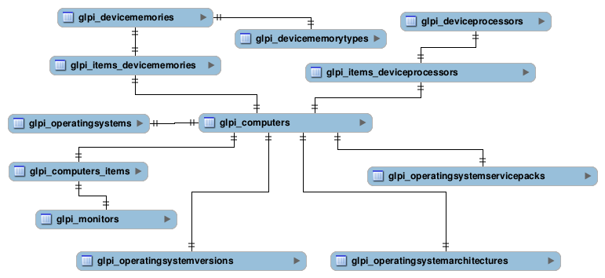

Database model
--------------

Current GLPI database contains more than 250 tables; the goal of the current documentation is to help you to understand the logic of the project, not to detail each table and possibility.

As on every database, there are tables, relations between them (more or less complex), some relations have descriptions stored in a another table, some tables way be linked with themselves... Well, it's quite common :) Let's start with a simple example:

.. note::

   The above schema is an example, it is far from complete!

What we can see here:

* computers are directly linked to operating systems, operating systems versions, operating systems architectures, ...,
* computers are linked to memories, processors and monitors using a relation table (which in that case permit to link those components to other items than a computer),
* memories have a type.

As stated in the above note, this is far from complete; but this is quite representative of the whole database schema.

Naming conventions
^^^^^^^^^^^^^^^^^^

All tables and fields names are lower case and follows the same logic. If you do not respect that; GLPI will fail to find relevant informations.

Tables
++++++

Tables names are linked with PHP classes names; they are all prefixed with ``glpi_``, and class name is set to plural. Plugins tables must be prefixed by ``glpi_plugin_``; followed by the plugin name, another dash, and then pluralized class name.

A few examples:

========================  ================================
PHP class name            Table name
========================  ================================
``Computer``              ``glpi_computers``
``Ticket``                ``glpi_tickets``
``ITILCategory``          ``glpi_itilcategories``
``PluginExampleProfile``  ``glpi_plugin_example_profiles``
========================  ================================

Fields
++++++

.. warning::

   Each table **must** have an auto-incremented primary key named ``id``.

Field naming is mostly up to you; exept for identifiers and foreign keys. Just keep clear and concise!

To add a foreign key field; just use the foreign table name without ``glpi_`` prefix, and add ``_id`` suffix.

.. warning::

   Even if adding a foreign key in a table should be perfectly correct; this is not the usual way things are done in GLPI, see `Make relations`_ to know more.

A few examples:

================================  ==============================
Table name                        Foreign key field name
================================  ==============================
``glpi_computers``                ``computers_id``
``glpi_tickets``                  ``tickets_id``
``glpi_itilcategories``           ``itilcategories_id``
``glpi_plugin_example_profiles``  ``plugin_example_profiles_id``
================================  ==============================

Make relations
++++++++++++++

On most cases, you may want to made possible to link many different items to something else. Let's say you want to make possible to link a `Computer`, a `Printer` or a `Phone` to a `Memory` component. You should add foreign keys in items tables; but on something as huge as GLPI, it maybe not a good idea.

Instead, create a relation table, that will reference the memory component along with a item id and a type, as for example:

.. code-block:: SQL

   CREATE TABLE `glpi_items_devicememories` (
      `id` int(11) NOT NULL AUTO_INCREMENT,
      `items_id` int(11) NOT NULL DEFAULT '0', 
      `itemtype` varchar(255) COLLATE utf8_unicode_ci DEFAULT NULL,
      `devicememories_id` int(11) NOT NULL DEFAULT '0',
      PRIMARY KEY (`id`),
      KEY `items_id` (`items_id`),
      KEY `devicememories_id` (`devicememories_id`),
      KEY `itemtype` (`itemtype`,`items_id`),
   ) ENGINE=MyISAM DEFAULT CHARSET=utf8 COLLATE=utf8_unicode_ci;

Again, this is a very simplified example of what already exists in the database, but you got the point ;)

In this example, ``itemtype`` would be ``Computer``, ``Printer`` or ``Phone``; ``items_id`` the ``id`` of the related item.

Indexes
^^^^^^^

In order to get correct performances querying database, you'll have to take care of setting some indexes. It's a nonsense to add indexes on every fields in the database; but some of them must be defined:

* foreign key fields;
* fields that are very often used (for example fields like ``is_visible``, ``itemtype``, ...),
* primary keys ;)

You should just use the field name as key name.
