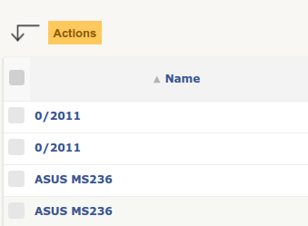

Massive Actions
---------------

Goals
^^^^^

Add to itemtypes :doc:`search lists <../devapi/search>`:

- a checkbox before each item,
- a checkbox to select all items checkboxes,
- an `Actions` button to apply modifications to each selected items.

Update item's fields
^^^^^^^^^^^^^^^^^^^^

The first option of the ``Actions`` button is ``Update``.
It permits to modify the fields content of the selected items.

The list of fields displayed in the sub list depends on the :ref:`search_options` of the current itemtype.
By default, all :ref:`search_options` are automatically displayed in this list.
To forbid this display for one field, you must define the key ``massiveaction`` to false in the :ref:`search_options` declaration, example:

.. code-block:: php

   <?php

   $tab[] = [
      'id'            => '1',
      'table'         => self::getTable(),
      'field'         => 'name',
      'name'          => __('Name'),
      'datatype'      => 'itemlink',
      'massiveaction' => false // <- NO MASSIVE ACTION
   ];

.. _massiveactions_specific:

Specific massive actions
^^^^^^^^^^^^^^^^^^^^^^^^

If default massive actions are not sufficient for your needs, you can define your own massive actions.
3 methods must be defined to achieve this.

1. declare the actions in ``getSpecificMassiveActions``
2. display the form in ``showMassiveActionsSubForm``
3. process in ``processMassiveActionsForOneItemtype``

.. code-block:: php

   <?php

   ...

    public function getSpecificMassiveActions($checkitem = null)
    {
        $actions = parent::getSpecificMassiveActions($checkitem);

        if (Session::haveRight(self::$rightname, UPDATE)) {
            $actions[self::class . MassiveAction::CLASS_ACTION_SEPARATOR . 'update_visibility']
                = __('Visibility');
        }

        return $actions;
    }

.. _massiveactions_specific_subform:

Next, implement ``showMassiveActionsSubForm`` to display the form :

.. code-block:: php

   <?php

   ...

   public static function showMassiveActionsSubForm(MassiveAction $ma) {
      switch ($ma->getAction()) {
         case 'myaction_key':
            echo __("fill the input");
            echo Html::input('myinput');
            echo Html::submit(__('Do it'), array('name' => 'massiveaction'))."";

            break;
      }

      return parent::showMassiveActionsSubForm($ma);
   }

.. _massiveactions_specific_process:

Finally, for processing implement ``processMassiveActionsForOneItemtype`` method:

.. code-block:: php

   <?php

   ...

   static function processMassiveActionsForOneItemtype(MassiveAction $ma, CommonDBTM $item,
                                                       array $ids) {
      switch ($ma->getAction()) {
         case 'myaction_key':
            $input = $ma->getInput();

            foreach ($ids as $id) {

               if ($item->getFromDB($id)
                   && $item->doIt($input)) {
                  $ma->itemDone($item->getType(), $id, MassiveAction::ACTION_OK);
               } else {
                  $ma->itemDone($item->getType(), $id, MassiveAction::ACTION_KO);
                  $ma->addMessage(__("Something went wrong"));
               }
            }
            return;
      }

      parent::processMassiveActionsForOneItemtype($ma, $item, $ids);
   }

Besides an instance of ``MassiveAction`` class ``$ma``, we have also an instance of the current ``itemtype`` ``$item and the list of selected id ``$ids``.

In this method, we could use some optional utility functions from the ``MassiveAction $ma`` object supplied in parameter :

- ``itemDone``, indicates the result of the current ``$id``, see constants of ``MassiveAction`` class. If we miss this call, the current ``$id`` will still be considered as OK.
- ``addMessage``, a string to send to the user for explaining the result when processing the current ``$id``
