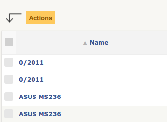

Massive Actions
---------------

Goals
^^^^^

Add to itemtypes :doc:`search lists <../devapi/search>`:

- a checkbox before each item,
- a checkbox to select all items checkboxes,
- an `Actions` button to apply modifications to each selected items.

Stages
^^^^^^

Processing is splitted in three stages (each handled by a different file).
They are determined by the ``MassiveAction`` constructor ``$stage`` parameter that determines its behaviour.

Stage 1: initial
""""""""""""""""

**File:** ``ajax/massiveaction.php``

**When:** The user checks items and clicks the bulk actions button.

What this stage does:

* Collects checked items (``$_POST['item'][itemtype][id] = 1``)
* Calls ``MassiveAction::getAllMassiveActions()`` for each itemtype → aggregates available actions
* Stores items in ``$POST['items']`` and the action list in ``$POST['actions']``
* Displays a dropdown listing available actions
* Each change in the dropdown triggers an AJAX call to the ``specialize`` stage

Stage 2: specialize
"""""""""""""""""""

**File:** ``ajax/dropdownMassiveAction.php``

**When:** The user selects an action from the dropdown.

What this stage does:

* Retrieves the chosen action and its label from ``$POST['actions']``
* Filters out items that do not support the action (via ``action_filter`` and ``getForbiddenStandardMassiveAction()``)
* Extracts the processor: if the action key contains ``ClassName:action_name``, the processor is ``ClassName``; otherwise ``MassiveAction`` is used by default
* Calls ``$processor::showMassiveActionsSubForm($ma)`` → displays fields specific to the action
* Hidden fields are injected via ``$ma->addHiddenFields()``

The processor is the class that contains the subform and the processing logic. It is encoded in the action key:

.. code-block:: php

   <?php

   // Action key with explicit processor
   $actions['MyClass:my_action'] = 'My action';

   // Implicit processor = MassiveAction
   $actions['MassiveAction:delete'] = 'Move to trash';

Stage 3: process
""""""""""""""""

**File:** ``front/massiveaction.php``

**When:** The user submits the form from the ``specialize`` stage.

What this stage does:

* Initialises result counters: ``ok``, ``ko``, ``noright``, ``noaction``, ``messages``
* Calls ``$ma->process()`` → ``processForSeveralItemtypes()``
* For each remaining itemtype, calls ``$processor::processMassiveActionsForOneItemtype($ma, $item, $ids)``
* Displays a progress bar
* If processing takes more than 5 seconds, reloads the page with the session identifier to continue (anti-timeout), via ``$ma->itemDone()``
* Redirects to the previous page with a result message

Update item's fields
^^^^^^^^^^^^^^^^^^^^

The first option of the ``Actions`` button is ``Update``.
It permits to modify the fields content of the selected items.

The list of fields displayed in the sub list depends on the :ref:`search_options` of the current itemtype.
By default, all :ref:`search_options` are automatically displayed in this list.
To forbid this display for one field, you must define the key ``massiveaction`` to false in the :ref:`search_options` declaration, example:

.. code-block:: php

   <?php

   $tab[] = [
      'id'            => '1',
      'table'         => self::getTable(),
      'field'         => 'name',
      'name'          => __('Name'),
      'datatype'      => 'itemlink',
      'massiveaction' => false // <- NO MASSIVE ACTION
   ];

.. _massiveactions_specific:

Specific massive actions
^^^^^^^^^^^^^^^^^^^^^^^^

If default massive actions are not sufficient for your needs, you can define your own massive actions.
3 methods must be defined to achieve this.

1. declare the actions in ``getSpecificMassiveActions``
2. display the form in ``showMassiveActionsSubForm``
3. process in ``processMassiveActionsForOneItemtype``

.. code-block:: php

   <?php

   ...

    public function getSpecificMassiveActions($checkitem = null)
    {
        $actions = parent::getSpecificMassiveActions($checkitem);

        if (Session::haveRight(self::$rightname, UPDATE)) {
            $actions[self::class . MassiveAction::CLASS_ACTION_SEPARATOR . 'update_visibility']
                = __('Visibility');
        }

        return $actions;
    }

.. _massiveactions_specific_subform:

Next, implement ``showMassiveActionsSubForm`` to display the form :

.. code-block:: php

   <?php

   ...

   public static function showMassiveActionsSubForm(MassiveAction $ma) {
      switch ($ma->getAction()) {
         case 'myaction_key':
            echo __("fill the input");
            echo Html::input('myinput');
            echo Html::submit(__('Do it'), array('name' => 'massiveaction'))."";

            break;
      }

      return parent::showMassiveActionsSubForm($ma);
   }

.. _massiveactions_specific_process:

Finally, for processing implement ``processMassiveActionsForOneItemtype`` method:

.. code-block:: php

   <?php

   ...

   static function processMassiveActionsForOneItemtype(MassiveAction $ma, CommonDBTM $item,
                                                       array $ids) {
      switch ($ma->getAction()) {
         case 'myaction_key':
            $input = $ma->getInput();

            foreach ($ids as $id) {

               if ($item->getFromDB($id)
                   && $item->doIt($input)) {
                  $ma->itemDone($item->getType(), $id, MassiveAction::ACTION_OK);
               } else {
                  $ma->itemDone($item->getType(), $id, MassiveAction::ACTION_KO);
                  $ma->addMessage(__("Something went wrong"));
               }
            }
            return;
      }

      parent::processMassiveActionsForOneItemtype($ma, $item, $ids);
   }

Besides an instance of ``MassiveAction`` class ``$ma``, we have also an instance of the current ``itemtype`` ``$item and the list of selected id ``$ids``.

In this method, we could use some optional utility functions from the ``MassiveAction $ma`` object supplied in parameter :

- ``itemDone``, indicates the result of the current ``$id``, see constants of ``MassiveAction`` class. If we miss this call, the current ``$id`` will still be considered as OK.
- ``addMessage``, a string to send to the user for explaining the result when processing the current ``$id``
