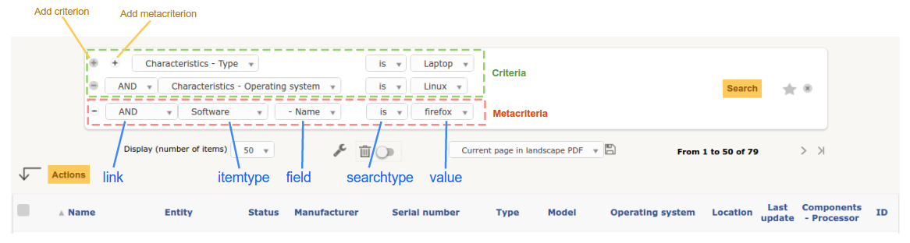

.. |br| raw:: html

    

Search Engine
-------------

Goal
^^^^

The `Search class <https://forge.glpi-project.org/apidoc/class-Search.html>`_ aims to provide a multi-criteria Search engine for GLPI Itemtypes.

It includes some short-cuts functions:

* ``show()``:              displays the complete search page.
* ``showGenericSearch()``: displays only the multi-criteria form.
* ``showList()``:          displays only the resulting list.
* ``getDatas()``:          return an array of raw data.
* ``manageParams()``:      complete the ``$_GET`` values with the ``$_SESSION`` values.

The show function parse the ``$_GET`` values (calling ``manageParams()``) passed by the page to retrieve the criteria and construct the SQL query. |br|
For showList function, :ref:`parameters <search_parameters>` can be passed in the second argument.

The itemtype classes can define a set of :ref:`search options <search_options>` to configure which columns could be queried, how they can be accessed and displayed, etc..

.. todo::

   * datafields option
   * difference between searchunit and delay_unit
   * dropdown translations
   * giveItem
   * export
   * fulltext search

Examples
++++++++

To display the search engine with its default options (criteria form, pager, list):

.. code-block:: php

   <?php
   $itemtype = 'Computer';
   Search::show($itemtype);

If you want to display only the multi-criteria form (with some additional options):

.. code-block:: php

   <?php
   $itemtype = 'Computer';
   $p = [
      'addhidden'   => [ // some hidden inputs added to the criteria form
         'hidden_input' => 'OK'
      ],
      'actionname'  => 'preview', //change the submit button name
      'actionvalue' => __('Preview'), //change the submit button label
   ];
   Search::showGenericSearch($itemtype, $p);

If you want to display only a list without the criteria form:

.. code-block:: php

   <?php
   // display a list of users with entity = 'Root entity'
   $itemtype = 'User';
   $p = [
      'start'      => 0,      // start with first item (index 0)
      'is_deleted' => 0,      // item is not deleted
      'sort'       => 1,      // sort by name
      'order'      => 'DESC'  // sort direction
      'reset'      => 'reset',// reset search flag
      'criteria'   => [
         [
            'field'      => 80,        // field index in search options
            'searchtype' => 'equals',  // type of search
            'value'      => 0,         // value to search
         ],
      ],
   ];
   Search::showList($itemtype, $p);

.. _search_parameters:

GET Parameters
^^^^^^^^^^^^^^

.. note::

   GLPI saves in ``$_SESSION['glpisearch'][$itemtype]`` the last set of parameters for the current itemtype for each search query. It is automatically restored on a new search if no ``reset``, ``criteria`` or ``metacriteria`` is defined.

Here is the list of possible keys which could be passed to control the search engine. |br|
All are optionals.

.. _search_criteria:

``criteria``
   An multi-dimensional array of criterion to filter the search. Each criterion array must provide:

      * ``link``: one of `AND`, `OR`, `AND NOT` or `OR NOT` logical operators, optional for first element,
      * ``field``: id of the :ref:`searchoption <search_options>`,
      * ``searchtype``: type of search, one of:

         * ``contains``
         * ``equals``
         * ``notequals``
         * ``lessthan``
         * ``morethan``
         * ``under``
         * ``notunder``

      * ``value``: the value to search

.. note::

   In order to find the ``field`` id you want, you may take a loook at the :ref:`getsearchoptions.php tool script <getsearchoptions_php>`.

``metacriteria``
   Very similar to :ref:`criteria parameter <search_criteria>` but permits to search in the :ref:`search options <search_options>` of an itemtype linked to the current (the softwares of a computer, for example).

   Not all itemtype can be linked, see `the getMetaItemtypeAvailable() method of the Search class <https://forge.glpi-project.org/apidoc/class-Search.html#_getMetaItemtypeAvailable>`_ to know which ones could be.

   The parameter need the same keys as criteria plus one additional:

   - *itemtype*: second itemtype to link.

``sort``
   id of the searchoption to sort by.

``order``
   Either ``ASC`` for ending sorting or ``DESC`` for ending sorting.

``start``
   An integer to indicate the start point of pagination (SQL ``OFFSET``).

``is_deleted``
   A boolean for display trash-bin.

``reset``
   A boolean to reset saved search parameters, see note below.

.. _search_options:

Search options
^^^^^^^^^^^^^^

Each itemtype can define a set of options to represent the columns which can be queried/displayed by the search engine. Each option is identified by an unique integer (we must avoid conflict).

.. versionchanged:: 9.2
   Searchoptions array has been completely rewritten; mainly to catch duplicates and add a unit test to prevent future issues.

   To permit the use of both old and new syntaxes; a new method has been created, ``getSearchOptionsNew()``. Old syntax is still valid (but do not permit to catch dups).

   The format has changed, but not the possible options and their values!

.. code-block:: php

   <?php
   function getSearchOptionsNew() {
      $tab = [];

      $tab[] = [
         'id'                 => 'common',
         'name'               => __('Characteristics')
      ];

      $tab[] = [
         'id'                 => '1',
         'table'              => self::getTable(),
         'field'              => 'name',
         'name'               => __('Name'),
         'datatype'           => 'itemlink',
         'massiveaction'      => false
      ];

      ...

      return $tab;
   }

.. note::

   For reference, the old way to write the same search options was:

   .. code-block:: php

      <?php
      function getSearchOptions() {
         $tab                       = array();
         $tab['common']             = __('Characteristics');

         $tab[1]['table']           = self::getTable();
         $tab[1]['field']           = 'name';
         $tab[1]['name']            = __('Name');
         $tab[1]['datatype']        = 'itemlink';
         $tab[1]['massiveaction']   = false;

         ...

         return $tab;
      }

Each option **must** define the following keys:

``table``
   The SQL table where the ``field`` key can be found.

``field``
   The SQL column to query.

``name``
   A label used to display the *search option* in the search pages (like header for example).

Optionally, it can defined the following keys:

``linkfield``
   Foreign key used to join to the current itemtype table. |br|
   If not empty, standard massive action (update feature) for this *search option* will be impossible

``searchtype``

   A string or an array containing forced search type:

      * ``equals`` (may force use of field instead of id when adding ``searchequalsonfield`` option)
      * ``contains``

``forcegroupby``
   A boolean to force group by on this *search option*

``splititems``
   Use ``
`` instead of `` `` to split grouped items

``usehaving``
   Use ``HAVING`` SQL clause instead of ``WHERE`` in SQL query

``massiveaction``
   Set to false to disable the massive actions for this *search option*.

``nosort``
   Set to true to disable sorting with this *search option*.

``nosearch``
   Set to true to disable searching in this *search option*.

``nodisplay``
   Set to true to disable displaying this *search option*.

``joinparams``
   Defines how the SQL join must be done. See :ref:`paragraph on joinparams <search_joinparams>` below.

``additionalfields``
   An array for additional fields to add in the ``SELECT`` clause. For example: ``'additionalfields' => ['id', 'content', 'status']``

``datatype``
   Define how the *search option* will be displayed and if a control need to be used for modification (ex: datepicker for date) and affect the *searchtype* dropdown. |br|
   *optional parameters* are added to the base array of the *search option* to control more exactly the datatype.

   See the :ref:`datatype paragraph <search_datatype>` below.

.. _search_joinparams:

Join parameters
+++++++++++++++

To define join parameters, you can use one or more of the following:

``beforejoin``

   Define which tables must be joined to access the field.

   The array contains ``table`` key and may contain an additional ``joinparams``. |br|
   In case of nested ``beforejoin``, we start the SQL join from the last dimension.

   Example:

   .. code-block:: php

      <?php
      [
         'beforejoin' => [
            'table'        => 'mytable',
            'joinparams'   => [
               'beforejoin' => [...]
            ]
         ]
      ]

``jointype``

   Define the join type:

   * ``empty`` for a standard jointype:::

      REFTABLE.`#linkfield#` = NEWTABLE.`id`

   * ``child`` for a child table:::

      REFTABLE.`id` = NEWTABLE.`#linkfield#`

   * ``itemtype_item`` for links using ``itemtype`` and ``items_id`` fields in new table:::

         REFTABLE.`id` = NEWTABLE.`items_id`
         AND NEWTABLE.`itemtype` = '#ref_table_itemtype#'

   * ``itemtype_item_revert`` (since 9.2.1) for links using ``itemtype`` and ``items_id`` fields in ref table:::

         NEWTABLE.`id` = REFTABLE.`items_id`
         AND REFTABLE.`itemtype` = '#new_table_itemtype#'

   * ``mainitemtype_mainitem`` same as ``itemtype_item`` but using mainitemtype and mainitems_id fields:::

      REFTABLE.`id` = NEWTABLE.`mainitems_id`
      AND NEWTABLE.`mainitemtype` = 'new table itemtype'

   * ``itemtypeonly`` same as ``itemtype_item`` jointype but without linking id:::

      NEWTABLE.`itemtype` = '#new_table_itemtype#'

   * ``item_item`` for table used to link two similar items: ``glpi_tickets_tickets`` for example: link fields are ``standardfk_1`` and ``standardfk_2``:::

      REFTABLE.`id` = NEWTABLE.`#fk_for_new_table#_1`
      OR REFTABLE.`id` = NEWTABLE.`#fk_for_new_table#_2`

   * ``item_item_revert`` same as ``item_item`` and child jointypes:::

      NEWTABLE.`id` = REFTABLE.`#fk_for_new_table#_1`
      OR NEWTABLE.`id` = REFTABLE.`#fk_for_new_table#_2`

``condition``

   Additional condition to add to the standard link.

   Use ``NEWTABLE`` or ``REFTABLE`` tag to use the table names.

   .. versionchanged:: 9.4

   An array of parameters used to build a `WHERE` clause from :doc:`GLPI querying facilities <database/dbiterator>`. Was previously only a string.

``nolink``

   Set to true to indicate the current join does not link to the previous join/from (nested ``joinparams``)

.. _search_datatype:

Data types
++++++++++

Available datatypes for search are:

``date``

   Available parameters (all optional):

   * ``searchunit``: one of `MySQL DATE_ADD unit`_, default to ``MONTH``
   * ``maybefuture``: display datepicker with future date selection, defaults to ``false``
   * ``emptylabel``: string to display in case of ``null`` value

``datetime``

   Available parameters (all optional) are the same as ``date``.

``date_delay``

   Date with a delay in month (``end_warranty``, ``end_date``).

   Available parameters (all optional) are the same as ``date`` and:

   * ``datafields``: array of data fields that would be used.

      * ``datafields[1]``: the date field,
      * ``datafields[2]``: the delay field,
      * ``datafields[2]``: ?

   * ``delay_unit``: one of `MySQL DATE_ADD unit`_, default to ``MONTH``

``timestamp``

   Use ``Dropdown::showTimeStamp()`` for modification

   Available parameters (all optional):

   * ``withseconds``: boolean (``false`` by default)

``weblink``

   Any URL

``email``

   Any email adress

``color``

   Use ``Html::showColorField()`` for modification

``text``

   Simple text

``string``

   Use a rich text editor for modification

``ip``

   Any IP adress

``mac``

   Available parameters (all optional):

   * ``htmltext``: boolean, escape the value (``false`` by default)

``number``

   Use a ``Dropdown::showNumber()`` for modification (in case of ``equals`` ``searchtype``). |br|
   For ``contains`` ``searchtype``, you can use `<` and `>` prefix in ``value``.

   Available parameters (all optional):

   * ``width``: html attribute passed to Dropdown::showNumber()
   * ``min``: minimum value (default ``0``)
   * ``max``: maximum value (default ``100``)
   * ``step``: step for select (default ``1``)
   * ``toadd``: array of values to add a the beginning of the dropdown

``integer``

   Alias for ``numbe``

``count``

   Same as ``number`` but count the number of item in the table

``decimal``

   Same as ``number`` but formatted with decimal

``bool``

   Use ``Dropdown::showYesNo()`` for modification

``itemlink``

   Create a link to the item

``itemtypename``

   Use ``Dropdown::showItemTypes()`` for modification

   Available parameters (all optional) to define available itemtypes:

   * ``itemtype_list``: one of `$CFG_GLPI["unicity_types"] <https://github.com/glpi-project/glpi/blob/9.1.2/config/define.php#L166>`_
   * ``types``: array containing available types

``language``

   Use ``Dropdown::showLanguages()`` for modification

   Available parameters (all optional):

   * ``display_emptychoice``: display an empty choice (``-------``)

``right``

   Use ``Profile::dropdownRights()`` for modification

   Available parameters (all optional):

   * ``nonone``: hide none choice ? (defaults to ``false``)
   * ``noread``: hide read choice ? (defaults to ``false``)
   * ``nowrite``: hide write choice ? (defaults to ``false``)

``dropdown``

   Use ``Itemtype::dropdown()`` for modification. |br|
   Dropdown may have several additional parameters depending of dropdown type : ``right`` for user one for example

``specific``

   If not any of the previous options matches the way you want to display your field, you can use this datatype. |br|
   See :ref:`specific search options <specific_search_options>` paragraph for implementation.

.. _specific_search_options:

Specific search options
+++++++++++++++++++++++

You may want to control how to select and display your field in a searchoption. |br|
You need to set 'datatype' => 'specific' in your search option and declare these methods in your class:

``getSpecificValueToDisplay``
   Define how to display the field in the list.

   Parameters:

   * ``$field``: column name, it matches the 'field' key of your searchoptions
   * ``$values``: all the values of the current row (for select)
   * ``$options``: will contains these keys:

      * ``html``,
      * ``searchopt``: the current full searchoption

``getSpecificValueToSelect``

   Define how to display the field input in the criteria form and massive action.

   Parameters:

   * ``$field``: column name, it matches the 'field' key of your searchoptions
   * ``$values``: the current criteria value passed in $_GET parameters
   * ``$name``: the html attribute name for the input to display
   * ``$options``: this array may vary strongly in function of the searchoption or from the massiveaction or criteria display. Check the corresponding files:

      * `searchoptionvalue.php <https://github.com/glpi-project/glpi/blob/ee667a059eb9c9a57c6b3ae8309e51ca99a5eeaf/ajax/searchoptionvalue.php#L128>`_
      * `massiveaction.class.php <https://github.com/glpi-project/glpi/blob/ee667a059eb9c9a57c6b3ae8309e51ca99a5eeaf/inc/massiveaction.class.php#L881>`_

Simplified example extracted from `CommonItilObject Class <https://forge.glpi-project.org/apidoc/class-CommonITILObject.html>`_ for ``glpi_tickets.status`` field:

.. code-block:: php

   <?php

   function getSearchOptionsMain() {
      $tab = [];

      ...

      $tab[] = [
         'id'          => '12',
         'table'       => $this->getTable(),
         'field'       => 'status',
         'name'        => __('Status'),
         'searchtype'  => 'equals',
         'datatype'    => 'specific'
      ];

      ...

      return $tab;
   }

   static function getSpecificValueToDisplay($field, $values, array $options=array()) {

      if (!is_array($values)) {
         $values = array($field => $values);
      }
      switch ($field) {
         case 'status':
            return self::getStatus($values[$field]);

         ...

      }
      return parent::getSpecificValueToDisplay($field, $values, $options);
   }

   static function getSpecificValueToSelect($field, $name='', $values='', array $options=array()) {

      if (!is_array($values)) {
         $values = array($field => $values);
      }
      $options['display'] = false;

      switch ($field) {
         case 'status' :
            $options['name']  = $name;
            $options['value'] = $values[$field];
            return self::dropdownStatus($options);

         ...
      }
      return parent::getSpecificValueToSelect($field, $name, $values, $options);
   }

Default Select/Where/Join
^^^^^^^^^^^^^^^^^^^^^^^^^

The search class implements three methods which add some stuff to SQL queries before the searchoptions computation. |br|
For some itemtype, we need to filter the query or additional fields to it. |br|
For example, filtering the tickets you cannot view if you do not have the proper rights.

GLPI will automatically call predefined methods you can rely on from your plugin ``hook.php`` file.

addDefaultSelect
++++++++++++++++

See `addDefaultSelect() method documentation <https://forge.glpi-project.org/apidoc/class-Search.html#_addDefaultSelect>`_

And in the plugin ``hook.php`` file:

.. code-block:: php

   <?php
   function plugin_mypluginname_addDefaultSelect($itemtype) {
      switch ($type) {
         case 'MyItemtype':
            return "`mytable`.`myfield` = 'myvalue' AS MYNAME, ";
      }
      return '';
   }

addDefaultWhere
+++++++++++++++

See `addDefaultWhere() method documentation <https://forge.glpi-project.org/apidoc/class-Search.html#_addDefaultWhere>`_

And in the plugin ``hook.php`` file:

.. code-block:: php

   <?php
   function plugin_mypluginname_addDefaultJoin($itemtype, $ref_table, &$already_link_tables) {
      switch ($itemtype) {
         case 'MyItemtype':
            return Search::addLeftJoin(
               $itemtype,
               $ref_table,
               $already_link_tables,
               'newtable',
               'linkfield'
            );
      }
      return '';
   }

addDefaultJoin
++++++++++++++

See `addDefaultJoin() method documentation <https://forge.glpi-project.org/apidoc/class-Search.html#_addDefaultJoin>`_

And in the plugin ``hook.php`` file:

.. code-block:: php

   <?php
   function plugin_mypluginname_addDefaultWhere($itemtype) {
      switch ($itemtype) {
         case 'MyItemtype':
            return " `mytable`.`myfield` = 'myvalue' ";
      }
      return '';
   }

Bookmarks
^^^^^^^^^

The ``glpi_boomarks`` table stores a list of search queries for the users and permit to retrieve them.

The ``query`` field contains an url query construct from :ref:`parameters <search_parameters>` with `http_build_query <http://php.net/manual/en/function.http-build-query.php>`_ PHP function.

Display Preferences
^^^^^^^^^^^^^^^^^^^

The ``glpi_displaypreferences`` table stores the list of default columns which need to be displayed to a user for an itemtype.

A set of preferences can be *personal* or *global* (``users_id = 0``). |br|
If a user does not have any personal preferences for an itemtype, the search engine will use the global preferences.

.. _MySQL DATE_ADD unit: https://dev.mysql.com/doc/refman/5.5/en/date-and-time-functions.html#function_date-add
