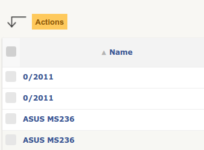

Plugin development tutorial
===========================

.. warning::

    ⚠️ Several prerequisites are required in order to follow this tutorial:

    - A base knowledge of GLPI usage
    - A correct level in web development:

        - PHP
        - HTML
        - CSS
        - SQL
        - JavaScript (JQuery)
    - Being familiar with command line usage

📝 In this first part, we will create a plugin named "My plugin" (key: ``myplugin``).
We will cover project startup as well as the setup of base elements.

Prerequisites
--------------

Here are all the things you need to start your GLPI plugin project:

* a functional web server,
* latest `GLPI <https://github.com/glpi-project/glpi/releases>`_ stable release installed locally
* a text editor or any IDE (like `vscode <https://code.visualstudio.com>`_ or `phpstorm <https://www.jetbrains.com/phpstorm/>`_),
* `git <https://git-scm.com/>`_ version management software.
* `Composer`_ PHP dependency software

Start your project
------------------

.. warning::

    ⚠️ If you have production data in your GLPI instance, make sure you disable all notifications before beginning the development.
    This will prevent sending of tests messages to users present in the imported data.

First of all, a few resources:

* `Empty`_ plugin and its `documentation <https://glpi-plugins.readthedocs.io/en/latest/empty/index.html>`_. This plugin is a kind of skeleton for quick starting a brand new plugin.
* `Example <https://github.com/pluginsGLPI/example>`_ plugin. It aims to do an exhaustive usage of GLPI internal API for plugins.

My new plugin
^^^^^^^^^^^^^

Clone ``empty`` plugin repository in you GLPI ``plugins`` directory:

::

   cd /path/to/glpi/plugins
   git clone https://github.com/pluginsGLPI/empty.git

You can use the ``plugin.sh`` script in the ``empty`` directory to create your new plugin. You must pass it the name of your plugin and the first version number. In our example:

::

   cd empty
   chmod +x plugin.sh
   ./plugin.sh myplugin 0.0.1

.. note::

    | ℹ️ Several conditions must be respected choosing a plugin name: no space or special character is allowed.
    | This name will be used to declare your plugin directory, as well as methods, constants, database tables and so on.
    | ``My-Plugin`` will therefore create the ``MyPlugin`` directory.
    | Using capital characters will cause issues for some core functions.

    Keep it simple!

When running the command, a new directory ``myplugin`` will be created at the same level as the ``empty`` directory (both in ``/path/to/glpi/plugin`` directory) as well as files and methods associated with an empty plugin skeleton.

.. note::

    ℹ️ If you cloned the ``empty`` project outside your GLPI instance, you can define a destination directory for your new plugin:

    .. code-block:: shell

        ./plugin.sh myplugin 0.0.1 /path/to/another/glpi/plugins/

Retrieving `Composer`_ dependencies
^^^^^^^^^^^^^^^^^^^^^^^^^^^^^^^^^^^

In a terminal, run the following command:

::

   cd /path/to/glpi/plugins/myplugin
   composer install

Minimal plugin structure
^^^^^^^^^^^^^^^^^^^^^^^^

.. raw:: html

   <pre>
   📂 glpi
     📂 plugins
       📂 myplugin
          📁 ajax
          📁 front
          📁 src
          📁 locales
          📁 tools
          📁 vendor
          🗋 composer.json
          🗋 hook.php
          🗋 LICENSE
          🗋 myplugin.xml
          🗋 myplugin.png
          🗋 Readme.md
          🗋 setup.php
   </pre>

* ``📂 front`` directory is used to store our object actions (create, read, update, delete).
* ``📂 ajax`` directory is used for ajax calls.
* Your plugin own classes will be stored in the ``📂 src`` directory.
* `gettext`_ translations will be stored in the ``📂 locales`` directory.
* An optional ``📂 templates`` directory would contain your plugin `Twig <https://twig.symfony.com/>`_ template files.
* ``📂 tools`` directory provides some optional scripts from the empty plugin for development and maintenance of your plugin. It is now more common to get those scripts from ``📂 vendor`` and ``📂 node_modules`` directories.
* ``📂 vendor`` directory contains:

  * PHP libraries for your plugin,
  * helpful tools provided by ``empty`` model.

* ``📂 node_modules`` directory contains JavaScript libraries for your plugin.
* ``🗋 composer.json`` files describes PHP dependencies for your project.
* ``🗋 package.json`` file describes JavaScript dependencies for your project.
* ``🗋 myplugin.xml`` file contains data description for :ref:`publishing your plugin <plugin_publication>`.
* ``🗋 myplugin.png`` image is often included in previous XML file as a representation for `GLPI plugins catalog <http://plugins.glpi-project.org>`_
* ``🗋 setup.php`` file is meant to :ref:`instantiate your plugin <plugin_minimal_setupphp>`.
* ``🗋 hook.php`` file :ref:`contains your plugin basic functions <plugin_minimal_hookphp>` (install/uninstall, hooks, etc).

.. _plugin_minimal_setupphp:

minimal setup.php
^^^^^^^^^^^^^^^^^

After running ``plugin.sh`` script, there muse be ``🗋 setup.php`` file in your ``📂 myplugin`` directory.

It contains the following code:

**🗋 setup.php**

.. code-block:: php
   :linenos:

   <?php

   define('PLUGIN_MYPLUGIN_VERSION', '0.0.1');

An optional constant declaration for your plugin version number used later in the ``plugin_version_myplugin`` function.

**🗋 setup.php**

.. code-block:: php
   :lineno-start: 3

   <?php

   function plugin_init_myplugin() {
      global $PLUGIN_HOOKS;

      $PLUGIN_HOOKS['csrf_compliant']['myplugin'] = true;
   }

This instanciation function is important, we will declare later here `Hooks` on GLPI internal API.
It's systematically called on **all** GLPI pages except if the ``_check_prerequisites`` fails (see below).
We declare here that our plugin forms are `CSRF <https://en.wikipedia.org/wiki/Cross-Site_Request_Forgery>`_ compliant even if for now our plugin does not contain any form.

**🗋 setup.php**

.. code-block:: php
   :lineno-start: 9

   <?php

   // Minimal GLPI version, inclusive
   define("PLUGIN_MYPLUGIN_MIN_GLPI_VERSION", "10.0.0");

   // Maximum GLPI version, exclusive
   define("PLUGIN_MYPLUGIN_MAX_GLPI_VERSION", "10.0.99");

   function plugin_version_myplugin()
   {
       return [
           'name'           => 'MonNouveauPlugin',
           'version'        => PLUGIN_MYPLUGIN_VERSION,
           'author'         => '<a href="http://www.teclib.com">Teclib\'</a>',
           'license'        => 'MIT',
           'homepage'       => '',
           'requirements'   => [
               'glpi' => [
                   'min' => PLUGIN_MYPLUGIN_MIN_GLPI_VERSION,
                   'max' => PLUGIN_MYPLUGIN_MAX_GLPI_VERSION,
               ]
       ];
   }

This function specifies data that will be displayed in the ``Configuration > Plugins`` menu of GLPI as well as some minimal constraints.
We reuse the constant ``PLUGIN_MYPLUGIN_VERSION`` declared above.
You can of course change data according to your needs.

.. note::

    ℹ️ **Choosing a license**

    The choice of a license is **important** and has many consequences on the future use of your developments. Depending on your preferences, you can choose a more permissive or restrictive orientation.
    Websites that can be of help exists, like https://choosealicense.com/.

    In our example, `MIT <https://fr.wikipedia.org/wiki/Licence_MIT>`_ license has been choose.
    It's a very popular choice which gives user enough liberty using your work. It just asks to keep the notice (license text) and respect the copyright. You can't be dispossessed of your work, paternity must be kept.

**🗋 setup.php**

.. code-block:: php
   :lineno-start: 32

   <?php

   function plugin_myplugin_check_config($verbose = false)
   {
       if (true) { // Your configuration check
           return true;
       }

       if ($verbose) {
           _e('Installed / not configured', 'myplugin');
       }

       return false;
   }

This function is systematically called on **all** GLPI pages.
It allows to automatically deactivate plugin if defined criteria are not or no longer met (returning ``false``).

.. _plugin_minimal_hookphp:

minimal hook.php
^^^^^^^^^^^^^^^^

This file must contains initialization and deinstallation functions:

**🗋 hook.php**

.. code-block:: php
   :linenos:

   <?php

   function plugin_myplugin_install()
   {
       return true;
   }

   function plugin_myplugin_uninstall()
   {
       return true;
   }

Whel all steps are OK, we must return ``true``.
WIll will populate those ones later while creating/removing database tables.

Install your plugin
^^^^^^^^^^^^^^^^^^^

.. image:: /_static/images/install_plugin.png
   :alt: mon plugin listé dans la configuration

Following those first steps, you should be able to install and activate your plugin from ``Configuration > Plugins`` menu.

Creating an object
------------------

| 📝 In this part, we will add an itemtype to our plugin and make it interact with GLPI.
| This will be a parent object that will regroup several "assets".
| We will name it "Superasset".

.. _commondntm_usage:

`CommonDBTM`_ usage and classes creation
^^^^^^^^^^^^^^^^^^^^^^^^^^^^^^^^^^^^^^^^

This super class allows to manipulate MySQL tables from PHP code.
Your working classes (in the ``src`` directory) can inherit from it and are called "itemtype" by convention.

.. note::

    ℹ️ **Conventions:**

    * Classes must respedct `PSR-12 naming conventions <https://www.php-fig.org/psr/psr-12/>`_. Wa maintain a :doc:`guide on coding standards <../codingstandards>`

    * :ref:`SQL tables <dbnaming_conventions>`_ related to your classes must respect that naming convention: ``glpi_plugin_pluginkey_names``
        * a global ``glpi_`` prefix
        * a prefix for plugins ``plugin_``
        * plugin key ``myplugin_``
        * itemtype name in plural form ``superassets``

    * :ref:`Tables columns Les champs de tables <dbfields>`_ must also follow some conventions:
        * there must be an ``auto-incremented primary`` field named ``id``
        * forgeign keys names use tha referenced table name without the global``glpi_``prefix and with and ``_id`` suffix. example: ``plugin_myotherclasses_id`` references ``glpi_plugin_myotherclasses`` table

        **Warnging!** GLPI do not use database foreign keys constraints. Therefore you must not use ``FOREIGN`` ou ``CONSTRAINT`` keys.

    * Some extra advices:
        * always end your files with an extra carriage return
        * never use the closing PHP tag ``?>`` - see https://www.php.net/manual/en/language.basic-syntax.instruction-separation.php

        Main reason for that is to avoid concatenation errors when using require/include functions, and prevent unexpected outputs.

We will create our first class in ``🗋 Superasset.php`` file in our plugin ``📂src`` directory:

.. raw:: html

   <pre>
   📂glpi
      📂plugins
         📂myplugin
            ...
            📂src
               🗋 Superasset.php
            ...
   </pre>

We declare a few parts:

**🗋 src/Superasset.php**

.. code-block:: php
   :linenos:

   <?php
   namespace GlpiPlugin\Myplugin;

   use CommonDBTM;

   class Superasset extends CommonDBTM
   {
       // right management, we'll change this later
       static $rightname = 'computer';

       /**
        *  Name of the itemtype
        */
       static function getTypeName($nb=0)
       {
           return _n('Super-asset', 'Super-assets', $nb);
       }
   }

.. warning::

    ⚠️ ``namespace`` must be `CamelCase <https://en.wikipedia.org/wiki/Camel_case>`_

.. note::

    ℹ️  Here are most common `CommonDBTM`_ inherited methods:

    `add(array $input) <https://github.com/glpi-project/glpi/blob/10.0.15/src/CommonDBTM.php#L1229-L1240>`_
    :  Add an new object in database table.
    ``input`` parameter contains table fields.
    If add goes well, the object will be populated with provided data.
    It returns the id of the new added line, or ``false`` if there were an error.

    .. code-block:: php
       :linenos:

        <?php

        namespace GlpiPlugin\Myplugin;

        $superasset = new Superasset;
        $superassets_id = $superasset->add([
            'name' => 'My super asset'
        ]);
        if (!superassets_id) {
            //super asset has not been created :'(
        }

    `getFromDB(integer $id) <https://github.com/glpi-project/glpi/blob/10.0.15/src/CommonDBTM.php#L285-L292>`_
    :  load a line from database into current object using its id.
    Fetched data will be available from ``fields`` object property.
    It returns ``false`` if the object does not exists.

    .. code-block:: php
        :lineno-start: 11

        <?php

        if ($superasset->getFromDB($superassets_id)) {
            //super $superassets_id has been lodaded.
            //you can access its data from $superasset->fields
        }

    `update(array $input) <https://github.com/glpi-project/glpi/blob/10.0.15/src/CommonDBTM.php#L1561-L1570>`_
    :  update fields of ``id`` identified line with ``$input`` parameter.
    The ``id`` key must be part of ``$input``.
    Returns a boolean.

    .. code-block:: php
        :lineno-start: 16

        <?php

        if (
            $superasset->update([
                'id'      => $superassets_id,
                'comment' => 'my comments'
            ])
        ) {
            //super asset comment has been updated in databse.
        }

    `delete(array $input, bool $force = false) <https://github.com/glpi-project/glpi/blob/10.0.15/src/CommonDBTM.php#L2027-L2036>`_
    :  remove ``id`` identified line corresponding.
    The ``id`` key must be part of ``$input``.
    ``$force`` parameter indicates if the line must be place in trashbin (``false``, and a ``is_deleted`` field must be present in the table) or removed (``true``).
    Returns a boolean.

    .. code-block:: php
        :lineno-start: 23

        <?php

        if ($superasset->delete(['id' => $superassets_id])) {
            //super asset has been moved to trashbin
        }

        if ($superasset->delete(['id' => $superassets_id], true)) {
            //super asset is no longer present un database.
            //a message will be displayed to user on next displayed page.
        }

Installation
^^^^^^^^^^^^

In the ``plugin_myplugin_install`` function of your ``🗋 hook.php`` file, we will manage the creation of the MySQL table corresponding to our itemtype ``Superasset``.

**🗋 hook.php**

.. code-block:: php
   :linenos:

   <?php

   use DBConnection;
   use GlpiPlugin\Myplugin\Superasset;
   use Migration;

   function plugin_myplugin_install()
   {
       global $DB;

       $default_charset   = DBConnection::getDefaultCharset();
       $default_collation = DBConnection::getDefaultCollation();

       // instantiate migration with version
       $migration = new Migration(PLUGIN_MYPLUGIN_VERSION);

       // create table only if it does not exist yet!
       $table = Superasset::getTable();
       if (!$DB->tableExists($table)) {
           //table creation query
           $query = "CREATE TABLE `$table` (
                     `id`         int unsigned NOT NULL AUTO_INCREMENT,
                     `is_deleted` TINYINT NOT NULL DEFAULT '0',
                     `name`      VARCHAR(255) NOT NULL,
                     PRIMARY KEY  (`id`)
                    ) ENGINE=InnoDB
                    DEFAULT CHARSET={$default_charset}
                    COLLATE={$default_collation}";
           $DB->queryOrDie($query, $DB->error());
       }

       //execute the whole migration
       $migration->executeMigration();

       return true;
   }

In addition, of a primary key, ``VARCHAR`` field to store a name entered by the user and a flag for the the trashbin.

.. note::
    📝 You of course can add some other fields with other types (stay reasonable 😉).

To handle migration from a version to another of our plugin, we will use GLPI `Migration`_ class.

**🗋 hook.php**

.. code-block:: php
   :linenos:

   <?php

   use Migration;

   function plugin_myplugin_install()
   {
       global $DB;

       // instantiate migration with version
       $migration = new Migration(PLUGIN_MYPLUGIN_VERSION);

       ...

       if ($DB->tableExists($table)) {
           // missing field
           $migration->addField(
               $table,
               'fieldname',
               'string'
           );

           // missing index
           $migration->addKey(
               $table,
               'fieldname'
           );
       }

       //execute the whole migration
       $migration->executeMigration();

       return true;
   }

.. warning::

  ℹ️ `Migration `_ class provides several methods that permit to manipulate tables and fields.
  All calls will be stored in queue that will be executed when calling ``executeMigration`` method.

  Here are some examples:

  `addField($table, $field, $type, $options) <https://github.com/glpi-project/glpi/blob/10.0.15/src/Migration.php#L389-L407>`_
    adds a new field to a table

  `changeField($table, $oldfield, $newfield, $type, $options) <https://github.com/glpi-project/glpi/blob/10.0.15/src/Migration.php#L462-L479>`_
    change a field name or type

  `dropField($table, $field) <https://github.com/glpi-project/glpi/blob/10.0.15/src/Migration.php#L534-L542>`_
    drops a field

  `dropTable($table) <https://github.com/glpi-project/glpi/blob/10.0.15/src/Migration.php#L553-L560>`_
    drops a table

  `renameTable($oldtable, $newtable) <https://github.com/glpi-project/glpi/blob/10.0.15/src/Migration.php#L654-L662>`_
    rename a table

  See `Migration`_ documentation for all other possibilities.

  .. raw:: html

    

  ``$type`` parameter of different functions is the same as the private `Migration::fieldFormat() method <https://github.com/glpi-project/glpi/blob/10.0.15/src/Migration.php#L252-L262>`_ it allows shortcut for most common SQL types (bool, string, integer, date, datatime, text, longtext,  autoincrement, char)

Uninstallation
^^^^^^^^^^^^^^

To uninstall our plugin, we want to clean all related data.

**🗋 hook.php**

.. code-block:: php
   :linenos:

   <?php

   use GlpiPlugin\Myplugin\Superasset;

   function plugin_myplugin_uninstall()
   {
       global $DB;

       $tables = [
           Superasset::getTable(),
       ];

       foreach ($tables as $table) {
           if ($DB->tableExists($table)) {
               $DB->doQueryOrDie(
                   "DROP TABLE `$table`",
                   $DB->error()
               );
           }
       }

      return true;
   }

Framework usage
^^^^^^^^^^^^^^^

Quelques fonctions utilitaires supplémentaires:

.. code-block:: php

   <?php

   Toolbox::logError($var1, $var2, ...);

Cette méthode permet d'enregistrer dans le fichier ``glpi/files/_log/php-errors.log`` le contenu de ses paramètres (qui peuvent être des chaînes de caractères, des tableaux, des objets instanciés, des booléens, etc).

.. code-block:: php

   <?php

   Html::printCleanArray($var);

Cette méthode affichera un tableau de "debug" de la variable fournie en paramètre. Elle n'accepte pas d'autre type que ``array``.

Common actions on an object
---------------------------

.. note::

    📝 We will now add most common actions to our ``Superasset`` itemtype:

    * display a list and a form to add/edit
    * define add/edit/delete routes

In our ``front`` directory, we will need two new files.

.. raw:: html

   <pre>
   📂 glpi
      📂 plugins
         📂 myplugin
            ...
            📂 front
               🗋 superasset.php
               🗋 superasset.form.php
            ...
   </pre>

.. warning::

    ℹ️ Into those files, we will import GLPI framework with the ofllowing:

    .. code-block:: php

        <?php

        include ('../../../inc/includes.php');

First file (``superasset.php``) will display liste of rows stored in our table.

It will use the internal search engine ``show`` method of the :doc:`search engine <../devapi/search>`.

**🗋 front/superasset.php**

.. code-block:: php
   :linenos:

   <?php

   use GlpiPlugin\Myplugin\Superasset;
   use Search;
   use Html;

   include ('../../../inc/includes.php');

   Html::header(
       Superasset::getTypeName(),
       $_SERVER['PHP_SELF'],
       "plugins",
       Superasset::class,
       "superasset"
   );
   Search::show(Superasset::class);
   Html::footer();

``header`` and ``footer`` methods from `Html`_ class permit to rely on GLPI graphical user interface (menu, breadcrumb, page footer, etc).

Second file (``superasset.form.php`` - with ``.form`` suffix) will handle CRUD actions.

**🗋 front/superasset.form.php**

.. code-block:: php
   :linenos:

   <?php

   use GlpiPlugin\Myplugin\Superasset;
   use Html;

   include ('../../../inc/includes.php');

   $supperasset = new Superasset();

   if (isset($_POST["add"])) {
       $newID = $supperasset->add($_POST);

       if ($_SESSION['glpibackcreated']) {
           Html::redirect(Superasset::getFormURL()."?id=".$newID);
       }
       Html::back();

   } else if (isset($_POST["delete"])) {
       $supperasset->delete($_POST);
       $supperasset->redirectToList();

   } else if (isset($_POST["restore"])) {
       $supperasset->restore($_POST);
       $supperasset->redirectToList();

   } else if (isset($_POST["purge"])) {
       $supperasset->delete($_POST, 1);
       $supperasset->redirectToList();

   } else if (isset($_POST["update"])) {
       $supperasset->update($_POST);
       \Html::back();

   } else {
       // fill id, if missing
       isset($_GET['id'])
           ? $ID = intval($_GET['id'])
           : $ID = 0;

       // display form
       Html::header(
          Superasset::getTypeName(),
          $_SERVER['PHP_SELF'],
          "plugins",
          Superasset::class,
          "superasset"
       );
       $supperasset->display(['id' => $ID]);
       Html::footer();
   }

All common actions defined here are handled from `CommonDBTM`_ class.
For missing display action, we will create a ``showForm`` method in our ``Superasset`` class.
Note this one already exists in ``CommonDBTM`` and is displayed using a generic Twig template.

We will use our own template that will extends the generic one (because it only displays common fields).

**🗋 src/Superasset.php**

.. code-block:: php
   :linenos:

   <?php

   namespace GlpiPlugin\Myplugin;

   use CommonDBTM;
   use Glpi\Application\View\TemplateRenderer;

   class Superasset extends CommonDBTM
   {

        ...

       function showForm($ID, $options=[])
       {
           $this->initForm($ID, $options);
           // @myplugin is a shortcut to the **templates** directory of your plugin
           TemplateRenderer::getInstance()->display('@myplugin/superasset.form.html.twig', [
               'item'   => $this,
               'params' => $options,
           ]);

           return true;
       }
   }

**🗋 templates/superasset.form.html.twig**

.. code-block:: twig
   :linenos:

   
   

   
       blabla
   

After that step, a call in our browser to `http://glpi/plugins/myplugin/front/superasset.form.php` shoudl display creation form.

.. warning::

    ℹ️  ``🗋 components/form/fields_macros.html.twig`` file imported in the example includes Twig functions or macros to display common HTML fields like:

    ``{{ fields.textField(name, value, label = '', options = {}) }}``
    : HTML code for a ``text`` input.

    ``{{ fields.hiddenField(name, value, label = '', options = {}) }``
    : HTML code for a ``hidden`` input.

    ``{{ dateField(name, value, label = '', options = {}) }``
    : HTML code for a date picker (using `flatpickr <https://flatpickr.js.org/>`_)

    ``{{ datetimeField(name, value, label = '', options = {}) }``
    : HTML code for a datetime picker (using `flatpickr <https://flatpickr.js.org/>`_)

    See ``🗋 templates/components/form/fields_macros.html.twig`` file in source code for more details and capacities.

Adding to menu and breadcrumb
-----------------------------

Idéalement, nous souhaiterions accéder à nos nouvelles pages sans taper directement l'url dans notre navigateur.

Nous allons donc définir notre premier ``hook`` dans l'init de notre plugin.

Éditons le fichier ``setup.php`` et la fonction ``plugin_init_myplugin`` :

**🗋 setup.php**

.. code-block:: php
   :linenos:

   <?php

   use GlpiPlugin\Myplugin\Superasset;

   function plugin_init_myplugin()
   {
       ...

       // add menu hook
       $PLUGIN_HOOKS['menu_toadd']['myplugin'] = [
           // insert into 'plugin menu'
           'plugins' => Superasset::class
       ];
   }

Ce ``hook`` indique que notre itemtype ``Superasset`` définit une fonction d'affichage du menu.
Editons notre classe et ajoutons les méthodes adaptées:

**🗋 src/Superasset.php**

.. code-block:: php
   :linenos:

   <?php

   namespace GlpiPlugin\Myplugin;

   use CommonDBTM;

   class Superasset extends CommonDBTM
   {
       ...

       /**
        * Define menu name
        */
       static function getMenuName($nb = 0)
       {
           // call class label
           return self::getTypeName($nb);
       }

       /**
        * Define additionnal links used in breacrumbs and sub-menu
        *
        * A default implementation is provided by CommonDBTM
        */
       static function getMenuContent()
       {
           $title  = self::getMenuName(2);
           $search = self::getSearchURL(false);
           $form   = self::getFormURL(false);

           // define base menu
           $menu = [
               'title' => __("My plugin", 'myplugin'),
               'page'  => $search,

               // define sub-options
               // we may have multiple pages under the "Plugin > My type" menu
               'options' => [
                   'superasset' => [
                       'title' => $title,
                       'page'  => $search,

                       //define standard icons in sub-menu
                       'links' => [
                           'search' => $search,
                           'add'    => $form
                       ]
                   ]
               ]
           ];

           return $menu;
       }
   }

La fonction ``getMenuContent`` peut paraître redondante au premier abord mais chacune des entrées codées adresse des parties de l'affichage différentes.
La partie ``options`` sert notamment à avoir un 4ème niveau de fil d'Ariane et ainsi avoir un sous menu cliquable dans votre page d'entrée.

.. image:: /_static/images/breadcrumbs.png
   :alt: Fil d’Ariane

Chaque clef ``page`` sert à indiquer sur quelle url s'applique la partie en cours.

.. note::

    ℹ️ Le menu de GLPI est chargé dans ``$_SESSION['glpimenu']`` à la connexion.
    Pour visualiser vos changements, si vous n'êtes pas en mode ``DEBUG``,  vous devrez vous déconnecter et reconnecter.

.. note::

    ℹ️ Notez qu'il est tout à fait possible d'avoir un seul niveau de menu pour le plugin (3 niveaux au global), il suffit de déplacer la partie ``links`` au premier niveau du tableau ``$menu``

.. note::

    ℹ️ Il est aussi possible de définir des ``links`` personnalisés.
    Il suffit pour cela de remplacer la clef (par exemple, add ou search) par un html contenant une balise image

    .. code-block:: php

        'links' = [
            '' => $url
        ]

Defning tabs
------------

GLPI fournit 3 méthodes standards pour la définition des onglets:

`defineTabs(array $options = []) <https://forge.glpi-project.org/apidoc/class-CommonGLPI.html#_defineTabs>`_
:  Déclaration des classes fournissant des onglets à la classe courante.

`getTabNameForItem(CommonGLPI $item, boolean $withtemplate = 0) <https://forge.glpi-project.org/apidoc/class-CommonGLPI.html#_getTabNameForItem>`_
:  Déclare les titres affichés pour les onglets.

`displayTabContentForItem(CommonGLPI $item, integer $tabnum = 1, boolean $withtemplate = 0) <https://forge.glpi-project.org/apidoc/class-CommonGLPI.html#_displayTabContentForItem>`_
:  Permet l'affichage du contenu des onglets.

Standards tabs
^^^^^^^^^^^^^^

De base certaines classes de l'api interne vous permettent d'ajouter un comportement avec un code minimal

C'est le cas pour les notes (`Notepad`_) et l'historique (`Log`_).

Voici un exemple pour ces deux systèmes:

**🗋 src/Superasset.php**

.. code-block:: php
   :linenos:

   <?php

   namespace GlpiPlugin\Myplugin;

   use CommonDBTM;
   use Notepad;
   use Log;

   class Superasset extends CommonDBTM
   {
       // permits to automaticaly store logs for this itemtype
       // in glpi_logs table
       public $dohistory = true;

       ...

       function defineTabs($options = [])
       {
           $tabs = [];
           $this->addDefaultFormTab($tabs)
               ->addStandardTab(Notepad::class, $tabs, $options)
               ->addStandardTab(Log::class, $tabs, $options);

           return $tabs;
       }
   }

L'affichage d'une instance de votre itemtype depuis la page ``front/superasset.php?id=1`` doit maintenant comporter 3 onglets:

* l'onglet principal du nom de votre itemtype
* l'onglet Notes
* l'onglet Historique

Custom tabs
^^^^^^^^^^^

De façon similaire, nous pouvons cibler une autre classe de notre plugin:

**🗋 src/Superasset.php**

.. code-block:: php
   :linenos:

   <?php

   namespace GlpiPlugin\Myplugin;

   use CommonDBTM;
   use Notepad;
   use Log;

   class Superasset extends CommonDBTM
   {
       // permits to automaticaly store logs for this itemtype
       // in glpi_logs table
       public $dohistory = true;

       ...

       function defineTabs($options = [])
       {
           $tabs = [];
           $this->addDefaultFormTab($tabs)
               ->addStandardTab(Superasset_Item::class, $tabs, $options);
               ->addStandardTab(Notepad::class, $tabs, $options)
               ->addStandardTab(Log::class, $tabs, $options);

           return $tabs;
       }

Dans cette nouvelle classe nous devrons définir les deux autres méthodes pour contrôler le titre et le contenu de l'onglet:

**🗋 src/Superasset_Item.php**

.. code-block:: php
   :linenos:

   <?php

   namespace GlpiPlugin\Myplugin;

   use CommonDBTM;
   use Glpi\Application\View\TemplateRenderer;

   class Superasset_Item extends CommonDBTM
   {
       /**
        * Tabs title
        */
       function getTabNameForItem(CommonGLPI $item, $withtemplate = 0)
       {
           switch ($item->getType()) {
               case Superasset::class:
                   $nb = countElementsInTable(self::getTable(),
                       [
                           'plugin_myplugin_superassets_id' => $item->getID()
                       ]
                   );
                   return self::createTabEntry(self::getTypeName($nb), $nb);
           }
           return '';
       }

       /**
        * Display tabs content
        */
       static function displayTabContentForItem(CommonGLPI $item, $tabnum = 1, $withtemplate = 0)
       {
           switch ($item->getType()) {
               case Superasset::class:
                   return self::showForSuperasset($item, $withtemplate);
           }

           return true;
       }

       /**
        * Specific function for display only items of Superasset
        */
       static function showForSuperasset(Superasset $superasset, $withtemplate = 0)
       {
           TemplateRenderer::getInstance()->display('@myplugin/superasset_item_.html.twig', [
               'superasset' => $superasset,
           ]);
       }
   }

Comme précédemment, nous utilisons un template pour gérer notre affichage.

**🗋 templates/superasset_item.html.twig**

.. code-block:: twig
   :linenos:

   

   example content

.. note::

    📝 **Exercice** :
    Pour la suite de cette partie, vous devrez compléter notre plugin pour permettre l'installation / désinstallation des données de cette nouvelle classe ``Superasset_Item``.

    Sa table devrait inclure les champs suivants:

    * un identifiant (id)
    * une clef étrangère vers la table ``plugin_myplugin_superassets``
    * deux champs pour faire la liaison avec un itemtype:

    * ``itemtype``, le nom de la classe à associer (ex: `Computer`_)
    * ``items_id``, une clef étrangère vers l'id de l'item

    Note, votre plugin doit être ré-installé ou mis à jour pour que la création de la table soit effectuée.
    Vous pouvez forcer le changement de status de votre plugin pour "A mettre à jour" en modifiant le numéro de version dans le fichier ``setup.php``.

    Pour l'exercice, nous nous limiterons à associer des ordinateurs (`Computer`_) que nous pourrons afficher avec la fonction suivante:

    .. code-block:: twig

        {{ fields.dropdownField(
            'Computer',
            'items_id',
            '',
            __('Add a computer')
        ) }}

    Nous inclurons dans notre onglet un **"mini" formulaire** pour insérer les items_id des ordinateurs à notre table. Les actions du formulaire pouvant être traitées par le fichier ``myplugin/front/supperasset.form.php``

    Note, les formulaires de GLPI envoyés en POST sont protégés par un jeton ([CSRF]).
    vous pouvez inclure un champs caché pour valider le formulaire:

    .. code-block:: twig

        <input type="hidden" name="_glpi_csrf_token" value="{{ csrf_token() }}">

    Nous ajouterons aussi en dessous du formulaire une liste des ordinateurs déjà associés.

Using core objets
^^^^^^^^^^^^^^^^^

Nous pouvons aussi permettre à notre classe d'ajouter des onglets sur les objets natifs du cœur.
Nous déclarons cet ajout via une nouvelle ligne dans notre fonction d'init:

**🗋 setup.php**

.. code-block:: php
   :linenos:

   <?php

   function plugin_init_myplugin()
   {
      ...

       Plugin::registerClass(GlpiPlugin\Myplugin\Superasset_Item::class, [
           'addtabon' => 'Computer'
       ]);
   }

Le titre et le contenu de cet onglet se font comme précédemment avec les méthodes:

* ``CommonDBTM::getTabNameForItem()``
* ``CommonDBTM::displayTabContentForItem()``

.. note::

    📝 **Exercice** :
    Complétez les méthodes précédentes pour afficher dans les ordinateurs un nouvel onglet listant les ``SuperAsset`` qui lui sont associés.

Defining Search options
-----------------------

Les :ref`Search options <search_options>` sont des registres de colonnes pour le moteur de recherche de GLPI. Elles permettent de déclarer comment doivent s'afficher ou être interrogées les données d'un itemtype.

Dans notre classe, il faut déclarer une fonction ``rawSearchOptions``:

**🗋 src/Superasset.php**

.. code-block:: php
   :linenos:

   <?php

   namespace GlpiPlugin\Myplugin;

   use CommonDBTM;

   class Superasset extends CommonDBTM
   {
       ...

       function rawSearchOptions()
       {
           $options = [];

           $options[] = [
               'id'   => 'common',
               'name' => __('Characteristics')
           ];

           $options[] = [
               'id'    => 1,
               'table' => self::getTable(),
               'field' => 'name',
               'name'  => __('Name'),
               'datatype' => 'itemlink'
           ];

           $options[] = [
               'id'    => 2,
               'table' => self::getTable(),
               'field' => 'id',
               'name'  => __('ID')
           ];

           $options[] = [
               'id'           => 3,
               'table'        => Superasset_Item::getTable(),
               'field'        => 'id',
               'name'         => __('Number of associated assets', 'myplugin'),
               'datatype'     => 'count',
               'forcegroupby' => true,
               'usehaving'    => true,
               'joinparams'   => [
                   'jointype' => 'child',
               ]
           ];

           return $options;
       }
   }

Suite à l'ajout de notre fonction, depuis la page de liste de notre itemtype, nous devrions pouvoir ajouter nos nouvelle colonnes depuis l’icône "clef à molette":

.. image:: /_static/images/search.png
   :alt: Search form

Ces options seront aussi présentes en critères de recherche dans le même formulaire.

Chaque ``option`` est identifiée par une clef ``id`` dans le tableau généré.
Cette clef est utilisée dans d'autres parties de glpi.
Elle doit être **absolument** unique.
Les index '1' et '2' sont "réservés" par convention au nom et à l'ID de l'objet.

La :ref:`documentation des search options <search_options>` décrit toutes les options possibles pour la définition du tableau à renvoyer.

Using other objects
^^^^^^^^^^^^^^^^^^^

Il est aussi possible d'enrichir les searchoptions d'un itemtype natif de GLPI. Par exemple, nous pourrions vouloir afficher dans la liste des ordinateurs les "Superasset" associés:

**🗋 hook.php**

.. code-block:: php
   :lineno-start: 50

   <?php

   use GlpiPlugin\Myplugin\Superasset;
   use GlpiPlugin\Myplugin\Superasset_Item;

   ...

   function plugin_myplugin_getAddSearchOptionsNew($itemtype)
   {
       $sopt = [];

       if ($itemtype == 'Computer') {
           $sopt[] = [
               'id'           => 12345,
               'table'        => Superasset::getTable(),
               'field'        => 'name',
               'name'         => __('Associated Superassets', 'myplugin'),
               'datatype'     => 'itemlink',
               'forcegroupby' => true,
               'usehaving'    => true,
               'joinparams'   => [
                   'beforejoin' => [
                       'table'      => Superasset_Item::getTable(),
                       'joinparams' => [
                           'jointype' => 'itemtype_item',
                       ]
                   ]
               ]
           ];
       }

       return $sopt;
   }

Comme précédemment, vous devez fournir un id pour vos nouvelles searchoptions qui n'écrase pas les existantes de ``Computer``.

Vous pouvez utiliser un outil présent dans le dossier ``tools`` du dépôt git de GLPI (non présent dans les archives de "release") pour vous aider à lister les **id** déjà déclarés (par le cœur et les plugins présents sur votre ordinateur) pour un itemtype particulier.

.. code-block:: shell

   /usr/bin/php /path/to/glpi/tools/getsearchoptions.php --type=Computer

Search engine display preferences
---------------------------------

Comme vu dans le `paragraphe précédent <#définir-des-searchoptions>`_, nous avons avons manuellement ajouté (par l'icône "clef à molette") des colonnes à la liste de notre itemtype.
Ces colonnes sont enregistrées par l'objet DisplayPreference (table ``glpi_displaypreferences``).
Ces préférences peuvent être globales (champ ``users_id = 0``) ou personnelles (champ ``users_id != 0``), sont ordonnées (champ ``rank``) et cible un itemtype plus une ``searchoption`` (champ ``num``).

.. warning::

    **⚠️ Attention**
    Les préférences globales s'appliquent à tous les utilisateurs et ne peuvent pas être réinitialisées de façon rapide. Il faut apporter un soin particulier à vérifier qu'ajouter des colonnes par défaut à tous les utilisateurs ne provoquera pas de blocage de l'interface voir de GLPI.

.. note::

    📝 **Exercice**:
    Vous ajouterez aux fonctions d'installation et de désinstallation du plugin l'ajout et la suppression des préférences globales pour que l'affichage par défaut de notre objet comporte quelques colonnes.

Standard events hooks
---------------------

Dans le cycle de vie d'un objet de GLPI, nous pouvons intervenir via notre plugin avant et après chaque événement (ajout, modification, suppression).

Pour nos propres objets, les méthodes suivantes peuvent être implémentées:

* `prepareInputForAdd <https://github.com/glpi-project/glpi/blob/10.0.15/src/CommonDBTM.php#L1536-L1543>`_
* `post_addItem <https://github.com/glpi-project/glpi/blob/10.0.15/src/CommonDBTM.php#L1549-L1554>`_
* `prepareInputForUpdate <https://github.com/glpi-project/glpi/blob/10.0.15/src/CommonDBTM.php#L1977-L1984>`_
* `post_updateItem <https://github.com/glpi-project/glpi/blob/10.0.15/src/CommonDBTM.php#L1990-L1997>`_
* `pre_deleteItem <https://github.com/glpi-project/glpi/blob/10.0.15/src/CommonDBTM.php#L2248-L2254>`_
* `post_deleteItem <https://github.com/glpi-project/glpi/blob/10.0.15/src/CommonDBTM.php#L2148-L2153>`_
* `post_purgeItem <https://github.com/glpi-project/glpi/blob/10.0.15/src/CommonDBTM.php#L2158-L2163>`_

Pour chacun des évènements effectivement appliqués sur la base de données, nous avons une méthode qui est exécutée avant et une autre après.

.. note::

    📝 **Exercice**:
    Ajoutez les méthodes nécessaires à la classe ``PluginMypluginSuperasset`` pour vérifier que le champ ``name`` soit correctement rempli lors de l'ajout et de la mise à jour.

    Dans le cas de la suppression (complète), nous nous assurerons de purger les données associées dans l'autre classe/table.

Les plugins peuvent aussi intercepter les évènements standards des objets du cœur afin d'y appliquer des changements (ou même refuser l’évènement). Voici le nom des ``hooks``:

.. code-block:: php
   :linenos:

   <?php

   use Glpi\Plugin\Hooks;

   ...

   Hooks::PRE_ITEM_ADD;
   Hooks::ITEM_ADD;
   Hooks::PRE_ITEM_DELETE;
   Hooks::ITEM_DELETE;
   Hooks::PRE_ITEM_PURGE;
   Hooks::ITEM_PURGE;
   Hooks::PRE_ITEM_RESTORE;
   Hooks::ITEM_RESTORE;
   Hooks::PRE_ITEM_UPDATE;
   Hooks::ITEM_UPDATE;

Plus d'informations sont disponibles dans la :ref:`documentation des hooks <standards_hooks>` et notamment sur la partie des :ref:`évènements standards <business_related_hooks>`.

Pour tous ces appels, nous obtiendrons une instance de l'objet courant en paramètre de notre fonction de "callback". Nous pourrons donc accéder à ses champs courants (``$item->fields``) ou ceux envoyés par le formulaire (``$item->input``).
Cette instance sera passée par référence (comme tous les objets php).

Nous déclarons l'usage de l'un de ces ``hooks`` dans la fonction d'init du plugin et ajouterons une fonction de ``callback``:

**🗋 setup.php**

.. code-block:: php
   :linenos:

   <?php

   use GlpiPlugin\Myplugin\Superasset;

   ...

   function plugin_init_myplugin()
   {
      ...

       // callback a function (declared in hook.php)
       $PLUGIN_HOOKS['item_update']['myplugin'] = [
           'Computer' => 'myplugin_computer_updated'
       ];

       // callback a class method
       $PLUGIN_HOOKS['item_add']['myplugin'] = [
            'Computer' => [
                 Superasset::class, 'computerUpdated'
            ]
       ];
   }

dans les deux cas (fonction de ``hook.php`` ou méthode de classe), le prototype des fonctions sera fait sur ce modèle:

.. code-block:: php
   :linenos:

   <?php

   use CommonDBTM;
   use Session;

   function hookCallback(CommonDBTM $item)
   {
       ...

       // if we need to stop the process (valid for pre* hooks)
       if ($mycondition) {
           // clean input
           $item->input = [];

           // store a message in session for warn user
           Session::addMessageAfterRedirect('Action forbidden because...');

           return;
      }
   }

.. note::

    📝 **Exercice**:
    Utilisez un ``hook`` interceptant la suppression définitive (purge) d'un ordinateur pour vérifier que des lignes de nos objets y sont associées et les supprimer également dans ce cas.

Importing libraries (Javascript / CSS)
--------------------------------------

Les plugins peuvent déclarer l'import de librairies supplémentaires depuis leur fonction init.

**🗋 setup.php**

.. code-block:: php
   :linenos:

   <?php

   use Glpi\Plugin\Hooks;

   function plugin_init_myplugin()
   {
       ...

       // css & js
       $PLUGIN_HOOKS[Hooks::ADD_CSS]['myplugin'] = 'myplugin.css';
       $PLUGIN_HOOKS[Hooks::ADD_JAVASCRIPT]['myplugin'] = [
           'js/common.js',
       ];

       // on ticket page (in edition)
       if (strpos($_SERVER['REQUEST_URI'], "ticket.form.php") !== false
           && isset($_GET['id'])) {
           $PLUGIN_HOOKS['add_javascript']['myplugin'][] = 'js/ticket.js.php';
       }

       ...
   }

Plusieurs choses à noter:

* Les chemins de chargement sont **relatifs** au répertoire du plugin.
* Les scripts ainsi déclarés seront par défaut chargés sur **toutes** les pages des glpi. Il convient de vérifier la page courante dans cette fonction init.
* L'extension du script n'est **pas** vérifiée par GLPI, vous pouvez tout à fait charger un fichier php en script js. Vous devrez forcer le mimetype ensuite dans le fichier chargé (ex: ``header("Content-type: application/javascript");``).
* Vous pouvez utilisez la libraire ``requirejs`` pour charger des ressources externes à glpi ou à votre plugin. Les chemins des scripts étant forcement absolus, l'url racine de GLPI sera forcement ajoutée en préfixe lors du chargement. Le `plugin XIVO <https://github.com/pluginsGLPI/xivo>`_ pour GLPI utilise cette méthode de chargement.
* Si vous souhaitez modifier le dom de glpi et notamment ce qui est affiché en formulaire principal, je vous conseille d'appeler votre code 2 fois (au chargement de la page et à celui de l'onglet en cours) et pensez à ajouter une classe permettant de vérifier l'application effective de votre code :

.. code-block:: javascript
   :linenos:

   $(function() {
       doStuff();
       $(".glpi_tabs").on("tabsload", function(event, ui) {
           doStuff();
       });
   });

   var doStuff = function()
   {
       if (! $("html").hasClass("stuff-added")) {
           $("html").addClass("stuff-added");

           // do stuff you need
           ...

       }
   };

.. note::

    📝 **Exercices**:

    #. Ajouter une icône supplémentaire dans le menu préférences (en haut à droite à coté du 'login' utilisateur), permettant d'afficher sur un clic la configuration générale de GLPI. Pour afficher votre icône, vous pouvez utiliser :

      * `tabler-icons <https://tabler-icons.io/>`_ (préféré), ex: ````).
      * `font-awesome v6 <https://fontawesome.com>`_, ex: ````).

    #. Dans la page d'edition d'un ticket, ajouter une icône pour s'auto-associer en tant que demandeur sur le modèle de celle présente pour la partie "attribué à".

Display hooks
-------------

Depuis la version 9.1.2 de GLPI, il est maintenant possible d'afficher des données dans les formulaires des objets natifs via de nouveaux hooks.
Voir :ref:`display related hooks <display_related_hooks>` dans la documentation des plugins.

Nous les déclarons comme les ``hooks`` précédents:

**🗋 setup.php**

.. code-block:: php
   :linenos:

   <?php

   use Glpi\Plugin\Hooks;
   use GlpiPlugin\Myplugin\Superasset;

   function plugin_init_myplugin()
   {
      ...

       $PLUGIN_HOOKS[Hooks::PRE_ITEM_FORM]['myplugin'] = [
           Superasset::class, 'preItemFormComputer'
       ];
   }

.. warning::

    ℹ️ **Important**
    Ces fonctions d'affichage diffèrent un peu des autres ``hooks`` au niveau des paramètres passés à la fonction de callback.
    Nous aurons un ``array`` contenant les clefs suivantes:

    * **'item'** avec l'objet CommonDBTM courant
    * **'options'**, ``array`` passée depuis la fonction showForm de l'objet courant

    exemple d'un appel par le coeur :

    .. code-block:: php

        <?php

        Plugin::doHook("pre_item_form", ['item' => $this, 'options' => &$options]);

.. note::

    📝 **Exercice**:
    Ajouter en entête du formulaire d'édition des ordinateurs indiquant le nombre de ``Super asset`` associés.
    Ce nombre devrait être un lien vers `l'onglet ajouté précédemment <#cibler-des-objets-du-cœur>`_ aux objets ordinateurs.
    Le lien pointera vers la même page mais avec un paramètre `forcetab=PluginMypluginSuperasset$1`.

Adding a configuration page
---------------------------

Afin de rendre optionnelles certaines parties de notre plugin, nous allons proposer un onglet dans la configuration générale de GLPI.

Précédemment, nous avons ajouté, via des hooks dans le fichier setup.php, un onglet aux ordinateurs ainsi qu'au début de leurs formulaires. Nous allons donc définir deux options de configuration afin d'activer / désactiver ces affichages à loisir.

GLPI fournit une table ``glpi_configs``, stockant la configuration du logiciel, qui permet aux plugins, via un système de contexte, de sauvegarder leurs propres données sans définir de table supplémentaire.

Tout d’abord, créons une nouvelle classe dans le dossier ``src/`` nommée Config.php dont voici le squelette:

**🗋 src/Config.php**

.. code-block:: php
   :linenos:

   <?php

   namespace GlpiPlugin\Myplugin;

   use Config;
   use CommonGLPI;
   use Dropdown;
   use Html;
   use Session;
   use Glpi\Application\View\TemplateRenderer;

   class Config extends \Config
   {

       static function getTypeName($nb = 0)
       {
           return __('My plugin', 'myplugin');
       }

       static function getConfig()
       {
           return Config::getConfigurationValues('plugin:myplugin');
       }

       function getTabNameForItem(CommonGLPI $item, $withtemplate = 0)
       {
           switch ($item->getType()) {
               case Config::class:
                   return self::createTabEntry(self::getTypeName());
           }
           return '';
       }

       static function displayTabContentForItem(
           CommonGLPI $item,
           $tabnum = 1,
           $withtemplate = 0
       ) {
           switch ($item->getType()) {
               case Config::class:
                   return self::showForConfig($item, $withtemplate);
           }

           return true;
       }

       static function showForConfig(
           Config $config,
           $withtemplate = 0
       ) {
           global $CFG_GLPI;

           if (!self::canView()) {
               return false;
           }

           $current_config = self::getConfig();
           $canedit        = Session::haveRight(self::$rightname, UPDATE);

           TemplateRenderer::getInstance()->display('@myplugin/config.html.twig', [
               'current_config' => $current_config,
               'can_edit'       => $canedit
           ]);
       }
   }

De nouveau, nous gérons l'affichage dans un gabarit dédié:

**🗋 templates/config.html.twig**

.. code-block:: twig
   :linenos:

   

   
       <form name="form" action="{{ "Config"|itemtype_form_path }}" method="POST">
           <input type="hidden" name="config_class" value="GlpiPlugin\\Myplugin\\Config">
           <input type="hidden" name="config_context" value="plugin:myplugin">
           <input type="hidden" name="_glpi_csrf_token" value="{{ csrf_token() }}">

           {{ fields.dropdownYesNo(
               'myplugin_computer_tab',
               current_config['myplugin_computer_tab'],
               __("Display tab in computer", 'myplugin')
           ) }}

           {{ fields.dropdownYesNo(
               'myplugin_computer_form',
               current_config['myplugin_computer_form'],
               __("Display information in computer form", 'myplugin')
           ) }}

           <button type="submit" class="btn btn-primary mx-1" name="update" value="1">
               <i class="ti ti-device-floppy"></i>
               {{ _x('button', 'Save') }}
           </button>
       </form>
   

Ce squelette récupéra les appels à un onglet dans le menu ``Configuration > Générale`` pour afficher le formulaire dédié à notre plugin.
Il n'est pas utile d'ajouter de fichier dans le dossier ``front``, notre formulaire renvoie vers la page ``front/config.form`` du cœur et sauvegardera les données sans plus de travaux.

Vous pouvez constater que nous affichons, via la fonction ``myplugin_computer_form`` deux champs Oui/Non nommés 'myplugin_computer_tab' et 'myplugin_computer_form'.

.. note::

    ✍️ Complétez le fichier ``setup.php`` en définissant l'ajout de l'onglet à la classe Config.

    Par ailleurs, vous devrez ajouter aux fonctions d'installation et de désinstallation l'ajout et la suppression des lignes de la table glpi_configs.
    Vous pourrez utiliser les fonctions suivantes :

    .. code-block:: php

        <?php

        use Config;

        Config::setConfigurationValues('##context##', [
            '##config_name##' => '##config_default_value##'
        ]);

    .. code-block:: php

        <?php

        use Config;

        $config = new Config();
        $config->deleteByCriteria(['context' => '##context##']);

    *Pensez à remplacer les noms entourés par '##' par vos propre valeurs*

Managing rights
---------------

Afin de limiter l’accès aux fonctionnalités de notre plugin à certains de nos utilisateurs, nous pouvons utiliser le système de la classe `Profile`_ de GLPI.

Celle-ci vérifie de base la propriété ``$rightname`` des classes héritant de `CommonDBTM`_ pour tous les évènements standard.
Ces vérifications sont effectuées par les fonctions ``static`` can*:

* `canCreate <https://forge.glpi-project.org/apidoc/class-CommonDBTM.html#_canCreate>`_ pour la méthode `add <(https://forge.glpi-project.org/apidoc/class-CommonDBTM.html#_add>`_)
* `canUpdate <https://forge.glpi-project.org/apidoc/class-CommonDBTM.html#_canUpdate>`_ pour la méthode `update <(https://forge.glpi-project.org/apidoc/class-CommonDBTM.html#_update>`_)
* `canDelete <https://forge.glpi-project.org/apidoc/class-CommonDBTM.html#_canDelete>`_ pour la méthode `delete <(https://forge.glpi-project.org/apidoc/class-CommonDBTM.html#_delete>`_)
* `canPurge <https://forge.glpi-project.org/apidoc/class-CommonDBTM.html#_canPurge>`_ pour la méthode `delete <(https://forge.glpi-project.org/apidoc/class-CommonDBTM.html#_delete>`_) aussi mais dans le cas ou le paramètre ``$force = true``

Afin de spécialiser la vérification de nos droits, nous pouvons re-définir ces fonctions statiques dans nos classes.

Si nous avons besoin de vérifier un droit manuellement dans notre code métier, la classe `Session`_ nous fourni quelques méthodes:

.. code-block:: php
   :linenos:

   <?php

   use Session;

   if (Session::haveRight(self::$rightname, CREATE)) {
      // OK
   }

   // we can also test a set multiple rights with AND operator
   if (Session::haveRightsAnd(self::$rightname, [CREATE, READ])) {
      // OK
   }

   // also with OR operator
   if (Session::haveRightsOr(self::$rightname, [CREATE, READ])) {
      // OK
   }

   // check a specific right (not your class one)
   if (Session::haveRight('ticket', CREATE)) {
      // OK
   }

Les méthodes ci dessus retournent toutes un booléen. Si nous voulons un arrêt de la page avec un message à destination de l'utilisateur, il existe des méthodes équivalente avec le préfixe ``check`` à la place de ``have``:

* `checkRight <https://github.com/glpi-project/glpi/blob/10.0.15/src/Session.php#L1109-L1117>`_
* `checkRightsOr <https://github.com/glpi-project/glpi/blob/10.0.15/src/Session.php#L1128-L1136>`_

.. warning::

    ℹ️ Si vous avez besoin de vérifier un droit directement dans une requête SQL, utilisez les opérateurs sur les bits ``&`` et ``|``:

    .. code-block:: php

        <?php

        $query = "SELECT `glpi_profiles_users`.`users_id`
            FROM `glpi_profiles_users`
            INNER JOIN `glpi_profiles`
                ON (`glpi_profiles_users`.`profiles_id` = `glpi_profiles`.`id`)
            INNER JOIN `glpi_profilerights`
                ON (`glpi_profilerights`.`profiles_id` = `glpi_profiles`.`id`)
            WHERE `glpi_profilerights`.`name` = 'ticket'
                AND `glpi_profilerights`.`rights` & ". (READ | CREATE);
        $result = $DB->query($query);

    Dans cet extrait de code, la partie ``READ | CREATE`` effectue une somme au niveau binaire et la partie ``&`` compare au niveau logique la valeur avec celle de la table.

Les valeurs possibles des droits standards peuvent être trouvés dans le fichier ``inc/define.php`` de GLPI:

.. code-block:: php
   :linenos:

   <?php

   ...

   define("READ", 1);
   define("UPDATE", 2);
   define("CREATE", 4);
   define("DELETE", 8);
   define("PURGE", 16);
   define("ALLSTANDARDRIGHT", 31);
   define("READNOTE", 32);
   define("UPDATENOTE", 64);
   define("UNLOCK", 128);

Add a new right
^^^^^^^^^^^^^^^

.. note::

    ✍️ We :ref:`previousely defined a property <commondntm_usage>` ``$rightname = 'computer'`` sur laquelle nous avons automatiquement les droits en tant que ``super-admin``.
    We will now create a specific right for the plugin.

Tout d’abord, nous allons créer une nouvelle classe dédiée à la gestion des profils:

**🗋 src/Profile.php**

.. code-block:: php
   :linenos:

   <?php
   namespace GlpiPlugin\Myplugin;

   use CommonDBTM;
   use CommonGLPI;
   use Html;
   use Profile as Glpi_Profile;

   class Profile extends CommonDBTM
   {
       public static $rightname = 'profile';

       static function getTypeName($nb = 0)
       {
           return __("My plugin", 'myplugin');
       }

       public function getTabNameForItem(CommonGLPI $item, $withtemplate = 0)
       {
           if (
               $item instanceof Glpi_Profile
               && $item->getField('id')
           ) {
               return self::createTabEntry(self::getTypeName());
           }
           return '';
       }

       static function displayTabContentForItem(
           CommonGLPI $item,
           $tabnum = 1,
           $withtemplate = 0
       ) {
           if (
               $item instanceof Glpi_Profile
               && $item->getField('id')
           ) {
               return self::showForProfile($item->getID());
           }

           return true;
       }

       static function getAllRights($all = false)
       {
           $rights = [
               [
                   'itemtype' => Superasset::class,
                   'label'    => Superasset::getTypeName(),
                   'field'    => 'myplugin::superasset'
               ]
           ];

           return $rights;
       }

       static function showForProfile($profiles_id = 0)
       {
           $profile = new Glpi_Profile();
           $profile->getFromDB($profiles_id);

           TemplateRenderer::getInstance()->display('@myplugin/profile.html.twig', [
               'can_edit' => self::canUpdate(),
               'profile'  => $profile
               'rights'   => self::getAllRights()
           ]);
       }
   }

De nouveau, nous afficheons le formulaire dans un gabarit Twig :

**🗋 templates/profile.html.twig**

.. code-block:: twig
   :linenos:

   
   

       <form name="form" action="{{ "Profile"|itemtype_form_path }}" method="POST">
           <input type="hidden" name="id" value="{{ profile.fields['id'] }}">
           <input type="hidden" name="_glpi_csrf_token" value="{{ csrf_token() }}">

           

           
               <button type="submit" class="btn btn-primary mx-1" name="update" value="1">
                   <i class="ti ti-device-floppy"></i>
                   {{ _x('button', 'Save') }}
               </button>
           
       </form>
   

Enfin dans notre fonction d'init, nous déclarons un nouvel onglet sur l'objet ``Profile``:

**🗋 setup.php**

.. code-block:: php
   :linenos:

   <?php

   use Plugin;
   use Profile;
   use GlpiPlugin\Myplugin\Profile as MyPlugin_Profile;

   function plugin_init_myplugin()
   {
      ...

       Plugin::registerClass(MyPlugin_Profile::class, [
           'addtabon' => Profile::class
       ]);
   }

Finalement, nous indiquons à l'installation d'enregistrer le droit et un accès minimal (pour le profil courant ``super-admin``):

**🗋 hook.php**

.. code-block:: php
   :linenos:

   <?php

   use GlpiPlugin\Myplugin\Profile as MyPlugin_Profile;
   use ProfileRight;

   function plugin_myplugin_install() {
      ...

      // add rights to current profile
      foreach (MyPlugin_Profile::getAllRights() as $right) {
         ProfileRight::addProfileRights([$right['field']]);
      }

      return true;
   }

   function plugin_myplugin_uninstall() {
      ...

      // delete rights for current profile
      foreach (MyPlugin_Profile::getAllRights() as $right) {
         ProfileRight::deleteProfileRights([$right['field']]);
      }

   }

A partir de ce moment, nous pouvons définir nos droits depuis le menu ``Administration > Profils`` et nous pouvons changer la propriété ``$righname`` de notre classe pour ``myplugin::superasset``.

Extending standard rights
^^^^^^^^^^^^^^^^^^^^^^^^^

Si nous avons besoin de droits spécifiques pour notre plugin, par exemple le droit d'effectuer les associations, il faut surcharger la fonction ``getRights`` dans la classe définissant les droits.

Dans l'exemple de classe ``PluginMypluginProfile`` définit plus haut, nous avons ajouté une méthode getAllRights qui indique que le droit ``myplugin::superasset`` est défini dans la classe ``PluginMypluginSuperasset``.
Celle-ci héritant de CommonDBTM, elle possède une méthode `getRights <https://forge.glpi-project.org/apidoc/class-CommonDBTM.html#_getRights>`_ que nous pouvons surcharger:

**🗋 src/Superasset.php**

.. code-block:: php
   :linenos:

   <?php

   namespace GlpiPlugin\Myplugin;

   use CommonDBTM;
   ...

   class Superasset extends CommonDBTM
   {
       const RIGHT_ONE = 128;

       ...

       function getRights($interface = 'central')
       {
           // if we need to keep standard rights
           $rights = parent::getRights();

           // define an additional right
           $rights[self::RIGHT_ONE] = __("My specific rights", "myplugin");

           return $rights;
       }
   }

Massive actions
---------------

Les actions massives de GLPI, mises à disposition des utilisateurs, permettent d'appliquer des modifications à l'ensemble d'une liste ou d'une sélection.

Par défaut, GLPI met à disposition les actions suivantes:

* "Modifier": pour éditer les champs définis dans les searchoptions (exceptées celles qui indique ``'massiveaction' = false``)
* "Mettre à la corbeille" / "Supprimer définitivement"

Il est possible de déclarer des :ref:`actions massives supplémentaires <massiveactions_specific>`.

Afin d'activer cette fonctionnalité dans votre plugin, il faut déclarer dans l'init le ``hook`` dédié:

**🗋 setup.php**

.. code-block:: php
   :linenos:

   <?php

   function plugin_init_myplugin()
   {
       ...

       $PLUGIN_HOOKS['use_massive_action']['myplugin'] = true;
   }

Ensuite dans la classe ``Superasset``, il faudra ajouter 3 méthodes:

* ``getSpecificMassiveActions``: déclaration des définitions des actions massives.
* ``showMassiveActionsSubForm``: affichage du sous-formulaire.
* ``processMassiveActionsForOneItemtype``: traitement de l'envoi du formulaire.

Ci dessous, un exemple d'implémentation minimal:

**🗋 src/Superasset.php**

.. code-block:: php
   :linenos:

   <?php

   namespace GlpiPlugin\Myplugin;

   use CommonDBTM;
   use Html;
   use MassiveAction;

   class Superasset extends CommonDBTM
   {
       ...

       function getSpecificMassiveActions($checkitem = NULL)
       {
           $actions = parent::getSpecificMassiveActions($checkitem);

           // add a single massive action
           $class        = __CLASS__;
           $action_key   = "myaction_key";
           $action_label = "My new massive action";
           $actions[$class . MassiveAction::CLASS_ACTION_SEPARATOR . $action_key] = $action_label;

           return $actions;
       }

       static function showMassiveActionsSubForm(MassiveAction $ma)
       {
           switch ($ma->getAction()) {
               case 'myaction_key':
                   echo __("fill the input");
                   echo Html::input('myinput');
                   echo Html::submit(__('Do it'), ['name' => 'massiveaction']) . "";

                   break;
           }

           return parent::showMassiveActionsSubForm($ma);
       }

       static function processMassiveActionsForOneItemtype(
           MassiveAction $ma,
           CommonDBTM $item,
           array $ids
       ) {
           switch ($ma->getAction()) {
               case 'myaction_key':
                   $input = $ma->getInput();

                   foreach ($ids as $id) {

                       if (
                           $item->getFromDB($id)
                           && $item->doIt($input)
                       ) {
                           $ma->itemDone($item->getType(), $id, MassiveAction::ACTION_OK);
                       } else {
                           $ma->itemDone($item->getType(), $id, MassiveAction::ACTION_KO);
                           $ma->addMessage(__("Something went wrong"));
                       }
                   }
                   return;
           }

           parent::processMassiveActionsForOneItemtype($ma, $item, $ids);
       }
   }

.. note::

    📝 **Exercice**:
    En vous aidant de la documentation officielle sur les :doc:`actions massives <../devapi/massiveactions>`, complétez dans votre plugin, les méthodes présentées ci-dessus pour permettre l'ajout d'un ordinateur via les actions massives des "Super assets".

    Vous pourrez afficher une liste des ordinateurs via l'extrait de code suivant:

    .. code-block:: php

        Computer::dropdown();

Il est aussi possible d'ajouter des actions massives aux itemtype natifs de GLPI.
Pour cela, il faut déclarer une fonction ``_MassiveActions`` dans le fichier hook.php:

**🗋 hook.php**

.. code-block:: php
   :linenos:

   <?php

   use Computer;
   use MassiveAction;
   use GlpiPlugin\Myplugin\Superasset;

   ...

   function plugin_myplugin_MassiveActions($type)
   {
      $actions = [];
      switch ($type) {
         case Computer::class:
            $class = Superasset::class;
            $key   = 'DoIt';
            $label = __("plugin_example_DoIt", 'example');
            $actions[$class.MassiveAction::CLASS_ACTION_SEPARATOR.$key]
               = $label;

            break;
      }
      return $actions;
   }

L'affichage du sous-formulaire et le traitement de l'envoi se gère de la même façon que pour les massives actions des itemtypes de votre propre plugin.

.. note::

    📝 **Exercice**:
    De la même façon que dans l'exercice précédent, ajoutez la possibilité d'affecter des ordinateurs à une "Super asset".

    Pensez à définir des clefs et labels différents que ceux précédemment développés.

Notifications
-------------

.. warning::
    ⚠️ Il est préférable d'avoir un accés à un serveur smtp et d'avoir saisi la configuration de celui ci dans GLPI (menu ``Configuration > Notifications > Configuration des suivis par courriels``). Dans le cas d'un environnement de développement, vous pouvez installer  `mailhog <https://github.com/mailhog/MailHog>`_ ou `mailcatcher <https://mailcatcher.me/>`_ qui exposent un serveur smtp local et vous permettent de récupérer les mails envoyés par GLPI dans une interface graphique.

    Veuillez aussi noter que GLPI n'envoit pas directement les mails. Il passe par un système de file d'attente.
    Toute les notifications "en attente" sont visibles dans le menu ``Administration > File d'attente des courriels``.
    Vous pouvez envoyer effectivement les mails par ce menu ou en forçant l'action massive ``queuedmail``.

Le système de notifications de GLPI permet l'envoi d'alertes à destination des acteurs d'un événement enregistré.
Par défaut le mode d'envoi est le mail mais il possible d'imaginer d'autres canaux (un envoi vers la messagerie instantanée Telegram est `en cours de développement <https://github.com/pluginsGLPI/telegrambot>`_).

Le système se décompose en plusieurs classes distinctes:

Notification:  L'objet principal. Il reçoit les champs communs tel un nom, l'activation, le mode d'envoi, l’événement déclencheur, un contenu (``NotificationTemplate``), etc.

.. image:: /_static/images/Notification.png
   :alt: Formulaire de l'objet Notification

NotificationTarget: Cette classe définit les destinataires d'une notification.
    Il est possible de définir des acteurs provenant de l'objet qui cible la notification (l'auteur, l'attributaire) comme des acteurs directs (tous les utilisateurs d'un groupe précis).

.. image:: /_static/images/NotificationTarget.png
   :alt: Formulaire de choix des acteurs

NotificationTemplate: Les modèles de notification permettent de construire le mail envoyé réellement et peuvent être choisis dans le formulaire de l'objet Notification. Nous pouvons définir du css dans cet objet et il reçoit une ou plusieurs instances de ``NotificationTemplateTranslation``

.. image:: /_static/images/NotificationTemplate.png
   :alt: Formulaire de modèle de notification

NotificationTemplateTranslation: Cet objet reçoit le contenu traduit des modèles. Veuillez noter qu'en l'absence de langue définie, le contenu s'appliquera quelque soit la langue de l'utilisateur.
Le contenu est généré dynamiquement avec des tags fournis à l'utilisateur et complété par de l'HTML.

.. image:: /_static/images/NotificationTemplateTranslation.png
   :alt: Formulaire de traduction de modèle

Tous ces objets sont gérés nativement par le cœur de GLPI et ne nécessitent pas d'intervention de notre part en terme de développement.

Nous pouvons par contre déclencher l’exécution d'une notification via le code suivant:

.. code-block:: php

   <?php

   use NotificationEvent;

   NotificationEvent::raiseEvent($event, $item);

La clef 'event' correspond au nom de l'événement déclencheur défini dans l'objet ``Notification`` et la clef 'itemtype' l'objet auquel il se rapporte.
Ainsi, cette fonction ``raiseEvent`` cherchera dans la table ``glpi_notifications`` une ligne active avec ces 2 caractéristiques.

Pour utiliser ce déclencheur dans notre plugin, nous ajouterons une nouvelle classe ``PluginMypluginNotificationTargetSuperasset``.
Celle-ci "cible" notre itemtype ``Superasset``, c'est la façon standard de développer des notifications dans GLPI. Nous avons un itemtype ayant une vie propre et un objet de notification s'y rapportant.

**🗋 src/NotificationTargetSuperasset.php**

.. code-block:: php
   :linenos:

   <?php

   namespace GlpiPlugin\Myplugin;

   use NotificationTarget;

   class NotificationTargetSuperasset extends NotificationTarget
   {

       function getEvents()
       {
           return [
               'my_event_key' => __('My event label', 'myplugin')
           ];
       }

       function getDatasForTemplate($event, $options = [])
       {
           $this->datas['##myplugin.name##'] = __('Name');
       }
   }

Il faudra indiquer en plus dans notre fonction d'init que notre itemtype ``Superasset`` peux envoyer des notifications:

**🗋 setup.php**

.. code-block:: php
   :linenos:

   <?php

   use Plugin;
   use GlpiPlugin\Myplugin\Superasset;

   function plugin_init_myplugin()
   {
      ...

       Plugin::registerClass(Superasset::class, [
           'notificationtemplates_types' => true
       ]);
   }

Avec ce code minimal, il est possible de créer manuellement, via l'interface de GLPI, une nouvelle notification ciblant notre itemtype ``Superasset`` et avec l’événement 'My event label' et d'utiliser la fonction raiseEvent avec ces paramètres.

.. note::

    📝 **Exercice** :
    Outre le test d'un envoi effectif, vous gérerez l'installation et la désinstallation automatique d'une notification et des objets associés (modèles, traductions).

    Vous pouvez prendre exemple sur la documentation (encore incomplète) sur les :doc:`notifications dans les plugins <notifications>`.

Automatic actions
-----------------

Cette fonctionnalité de GLPI fournit un planificateur de tâches exécutées silencieusement par les clics de l'utilisateur (mode GLPI) ou par le serveur en ligne de commande (mode cli) via un appel du fichier ``front/cron.php`` de glpi.

.. image:: /_static/images/crontask.png
   :alt: image alt

Pour ajouter une ou plusieurs actions automatiques à notre classe, nous y ajoutons ces méthodes:

* ``cronInfo``: déclaration des actions possibles pour la classe ainsi que les libellés associés
* ``cron*Action*``: une fonction pour chaque action définie dans ``cronInfo``. Ces fonctions sont appelées pour lancer le traitement effectif de l'action.

**🗋 src/Superasset.php**

.. code-block:: php
   :linenos:

   <?php

   namespace GlpiPlugin\Myplugin;

   use CommonDBTM;

   class Superasset extends CommonDBTM
   {
       ...

       static function cronInfo($name)
       {

           switch ($name) {
               case 'myaction':
                   return ['description' => __('action desc', 'myplugin')];
           }
           return [];
       }

       static function cronMyaction($task = NULL)
       {
           // do the action

           return true;
       }
   }

Pour indiquer l'existence de cette action automatique à GLPI, il suffit de l'installer:

**🗋 hook.php**

.. code-block:: php
   :linenos:

   <?php

   use CronTask;

   function plugin_myplugin_install()
   {

       ...

       CronTask::register(
           PluginMypluginSuperasset::class,
           'myaction',
           HOUR_TIMESTAMP,
           [
               'comment'   => '',
               'mode'      => \CronTask::MODE_EXTERNAL
           ]
       );
   }

Inutile de gérer la supression (unregister) de cette action, GLPI s'occupe de le faire automatiquement à la désinstallation du plugin.

.. _plugin_publication:

Publishing your plugin
----------------------

Vous estimez votre plugin suffisamment mature et celui-ci couvre un besoin générique, vous pouvez le soumettre à la communauté.

Le `catalogue des plugins <http://plugins.glpi-project.org/>`_ permet aux utilisateurs de GLPI de découvrir, télécharger et suivre les plugins fournis par la communauté de développeurs.

Publiez votre code sur un dépôt git accessible au public (nous utilisons `github <https://github.com/>`_, mais vous pouvez `gitlab <https://gitlab.com/explore>`_), incluez une licence `open source <https://choosealicense.com/>`_ de votre choix et préparez un xml de description de votre plugin.
Le XML doit respecter cette structure:

.. code-block:: xml
   :linenos:

   <root>
      <name>Displayed name</name>
      <key>System name</key>
      <state>stable</state>
      <logo>http://link/to/logo/with/dimensions/40px/40px</logo>
      <description>
         <short>
            <en>short description of the plugin, displayed on list, text only</en>
            <lang>...</lang>
         </short>
         <long>
            <en>short description of the plugin, displayed on detail, Markdown accepted</en>
            <lang>...</lang>
         </long>
      </description>
      <homepage>http://link/to/your/page</homepage>
      <download>http://link/to/your/files</download>
      <issues>http://link/to/your/issues</issues>
      <readme>http://link/to/your/readme</readme>
      <authors>
         <author>Your name</author>
      </authors>
      <versions>
         <version>
            <num>1.0</num>
            <compatibility>0.90</compatibility>
         </version>
      </versions>
      <langs>
         <lang>en_GB</lang>
         <lang>...</lang>
      </langs>
      <license>GPL v2+</license>
      <tags>
         <en>
            <tag>tag1</tag>
         </en>
         <lang>
            <tag>tag1</tag>
         </lang>
      </tags>
      <screenshots>
         <screenshot>http://link/to/your/screenshot</screenshot>
         <screenshot>http://link/to/your/screenshot</screenshot>
         <screenshot>...</screenshot>
      </screenshots>
   </root>

Soignez le contenu de ce XML: ajoutez une belle description en plusieurs langues, une icône représentative et des captures, bref, donnez envie aux utilisateurs :star2:

Enfin, soumettez votre xml sur la `page dédiée <http://plugins.glpi-project.org/#/submit>`_ du catalogue des plugins (une inscription est nécessaire).

Teclib recevra une notification pour cette soumission et après quelques vérifications, activera la publication sur le catalogue.

Miscellaneous
-------------

Querying database
^^^^^^^^^^^^^^^^^

Il existe 2 méthodes:

La première consiste à utilise directement la variable globale ``$DB`` et les fonctions de base mysql. Exemple:

.. code-block:: php
   :linenos:

   <?php

   function myfunction()
   {
      global $DB;

      $query = "SELECT * FROM glpi_computers";
      $res   = $DB->query($query);
      if ($DB->numrows($res)) {
         while ($data = $DB->fetch_assoc(res)) {
            ...
         }
      }
   }

Pour plus de détails, regardez l'api et les fonctions disponibles dans la classe `DBmysql <https://forge.glpi-project.org/apidoc/class-DBmysql.html>`_.

La seconde méthode est à privilégier et consiste à utiliser la classe `DBmysqlIterator <https://forge.glpi-project.org/apidoc/class-DBmysqlIterator.html>`_.
Elle a été fortement enrichie depuis la version 9.2 de GLPI et fournit un ``query builder`` exhaustif.
Voir :doc:`la documentation de l'itérateur de base de données <../devapi/database/dbiterator>` pour le détail des options possibles.

Voici quelques exemples d'usage:

.. code-block:: php
   :linenos:

   <?php

   foreach ($DB->request(...) as $id => $row) {
       //... work on each row ...
   }

   // => SELECT * FROM `glpi_computers`
   $DB->request(['FROM' => 'glpi_computers']);

   // => SELECT * FROM `glpi_computers`, `glpi_computerdisks`
   //       WHERE `glpi_computers`.`id` = `glpi_computerdisks`.`computer_id`
   $DB->request([
       'FROM' => ['glpi_computers', 'glpi_computerdisks'],
       'FKEY' => [
           'glpi_computers' => 'id',
           'glpi_computerdisks' => 'computer_id'
       ]
   ]);

L'utilisation de cet "iterateur" est conseillé car de futures versions de GLPI utiliseront de multiples moteur de base de données (Postgres par exemple) et à ce passage, vos requêtes seront directement compatibles sans nécessité de ré-écriture.

Dashboards
^^^^^^^^^^

Depuis la version 9.5 de GLPI, des tableaux de bord sont disponibles depuis :

* la page centrale
* le menu Parc
* le menu Assistance

Cette fonctionnalité se décompose en plusieurs concepts - sous classes :

* un grille (``Glpi\Dashboard\Grid``) de placement de 26*24
* une collection de widgets (``Glpi\Dashboard\Widget``) pour permettre d'afficher des données sous forme graphique
* une collection de fournisseurs de données (``Glpi\Dashboard\Provider``) qui effectuent les requêtes SQL sur la base de données
* des droits (``Glpi\Dashboard\Right``) pour définir les droits d'accès à un tableau de bord
* des filtres (``Glpi\Dashboard\Filter``) pouvant s'afficher en entête d'un tableau de bord et impactant les fournisseurs.

Avec ces classes, on peut construire un tableau de bord qui affichera sur sa grille des cartes.
Une carte est une combinaison d'un widget, d'un fournisseur de données, d'un positionnement sur un grille et diverses options (comme une couleur de fond par exemple).

Complting existing
~~~~~~~~~~~~~~~~~~

Via votre plugin, vous pouvez compléter ces concepts avec vos propres données et codes.

**🗋 setup.php**

.. code-block:: php
   :linenos:

   <?php

   use Glpi\Plugin\Hooks;
   use GlpiPlugin\Myplugin\Dashboard;

   function plugin_init_myplugin()
   {
       ...

       // add new widgets to the dashboard
       $PLUGIN_HOOKS[Hooks::DASHBOARD_TYPES]['myplugin'] = [
           Dashboard::class => 'getTypes',
       ];

       // add new cards to the dashboard
       $PLUGIN_HOOKS[Hooks::DASHBOARD_CARDS]['myplugin'] = [
           Dashboard::class => 'getCards',
       ];
   }

En complément, créons une classe dédiée à nos ajouts aux tableaux de bord de GLPI:

**🗋 src/Dashboard.php**

.. code-block:: php
   :linenos:

   <?php

   namespace GlpiPlugin\Myplugin;

   class Dashboard
   {
       static function getTypes()
       {
           return [
               'example' => [
                   'label'    => __("Plugin Example", 'myplugin'),
                   'function' => __class__ . "::cardWidget",
                   'image'    => "https://via.placeholder.com/100x86?text=example",
               ],
               'example_static' => [
                   'label'    => __("Plugin Example (static)", 'myplugin'),
                   'function' => __class__ . "::cardWidgetWithoutProvider",
                   'image'    => "https://via.placeholder.com/100x86?text=example+static",
               ],
           ];
       }

       static function getCards($cards = [])
       {
           if (is_null($cards)) {
               $cards = [];
           }
           $new_cards =  [
               'plugin_example_card' => [
                   'widgettype'   => ["example"],
                   'label'        => __("Plugin Example card"),
                   'provider'     => "PluginExampleExample::cardDataProvider",
               ],
               'plugin_example_card_without_provider' => [
                   'widgettype'   => ["example_static"],
                   'label'        => __("Plugin Example card without provider"),
               ],
               'plugin_example_card_with_core_widget' => [
                   'widgettype'   => ["bigNumber"],
                   'label'        => __("Plugin Example card with core provider"),
                   'provider'     => "PluginExampleExample::cardBigNumberProvider",
               ],
           ];

           return array_merge($cards, $new_cards);
      }

       static function cardWidget(array $params = [])
       {
           $default = [
               'data'  => [],
               'title' => '',
               // this property is "pretty" mandatory,
               // as it contains the colors selected when adding widget on the grid send
               // without it, your card will be transparent
               'color' => '',
           ];
           $p = array_merge($default, $params);

           // you need to encapsulate your html in div.card to benefit core style
           $html = "
";
           $html.= "<h2>{$p['title']}</h2>";
           $html.= "<ul>";
           foreach ($p['data'] as $line) {
               $html.= "<li>$line</li>";
           }
           $html.= "</ul>";
           $html.= "
";

           return $html;
       }

       static function cardWidgetWithoutProvider(array $params = [])
       {
         $default = [
            // this property is "pretty" mandatory,
            // as it contains the colors selected when adding widget on the grid send
            // without it, your card will be transparent
            'color' => '',
         ];
         $p = array_merge($default, $params);

         // you need to encapsulate your html in div.card to benefit core style
         $html = "

                     static html (+optional javascript) as card is not matched with a data provider
                     
                  
";

         return $html;
      }

       static function cardBigNumberProvider(array $params = [])
       {
           $default_params = [
               'label' => null,
               'icon'  => null,
           ];
           $params = array_merge($default_params, $params);

           return [
               'number' => rand(),
               'url'    => "https://www.linux.org/",
               'label'  => "plugin example - some text",
               'icon'   => "fab fa-linux", // font awesome icon
           ];
      }
   }

Quelques explications sur les différentes méthodes :

* ``getTypes()`` : permet de définir les widgets disponibles pour les cartes et les fonctions à appeler pour faire l'affichage.
* ``getCards()`` : permet de définir les cartes disponibles pour les tableaux de bord (quand une est ajoutée à la grille). Comme expliqué précédemment, chacune est définie par une combinaison d'un label, d'un widget et optionnellement un fournisseur de données (provenant de votre plugin ou du coeur de GLPI)
* ``cardWidget()`` : utilise le paramètre fourni pour afficher un html. Libre à vous ici de déléguer l'affichage via un gabarit TWIG et d'utiliser votre bibliothèque javascript préférée.
* ``cardWidgetWithoutProvider()`` : Ne diffère pas énormement de la précédente fonction. Elle n'utilise juste pas le paramètre et retourne un HTML construit statiquement.
* ``cardBigNumberProvider()`` : exemple de fournisseur et du retour attendu par la grille lorsqu'elle affichera la carte.

Display your own dashboard
~~~~~~~~~~~~~~~~~~~~~~~~~~

Le systeme de tableaux de bord de GLPI étant modulaire, vous pouvez l'utiliser dans vos propres affichages.

.. code-block:: php
   :linenos:

   <?php

   use Glpi\Dashboard\Grid;

   $dashboard = new Grid('myplugin_example_dashboard', 10, 10, 'myplugin');
   $dashboard->show();

Le fait d'ajouter un contexte (``myplugin``) permet de filtrer les tableaux de bord disponible dans la liste déroulante disponible en haut à droite de la grille. Vous ne verrez pas ceux du coeur de GLPI (central, assistance, etc.).

Translating your plugins
^^^^^^^^^^^^^^^^^^^^^^^^

Tout au long de ce document, les exemples de code fournis ont pris soin d'utiliser les notations `gettext`_ de GLPI pour afficher des locales.
Même si votre plugin n'a pas vocation à publication et est destiné à un public restreint, c'est une bonne pratique de conserver tout de même cet usage de `gettext`_.

Le framework de GLPI fournit les fonctions suivantes pour la définition de vos locales:

* `__(string[, domain]) <https://forge.glpi-project.org/apidoc/function-__.html>`_: chaine de caractère simple.
* `_n(singular, plural, nb[, domain]) <https://forge.glpi-project.org/apidoc/function-_n.html>`_: chaine de caractère au singulier ou pluriel (le choix étant effectué selon la clef 'nb')
* `_sx(context, string[, domain]) <https://forge.glpi-project.org/apidoc/function-_sx.html>`_: identique à __() mais avec une option de contexte.
* `_nx(context, singular, plural, nb[, domain]) <https://forge.glpi-project.org/apidoc/function-_nx.html>`_: identique à _n() mais avec une option de contexte.

Le ``domain`` représente l'endroit ou sont stockées les "locales".
Par défaut (et en absence de ce paramètre), on considère que la chaîne est dans la collection de locales de GLPI. Pour vos plugins, il est important d'ajouter la clef le représentant dans ce paramètre.

Le ``context``, jamais affiché, permet de fournir aux traducteurs une indication sur le contenu de la chaine. Selon les langues, un même mot peut avoir plusieurs significations, nous avons donc besoin d'ajouter une précision.

`gettext`_ fonctionne avec 3 types de fichiers:

* un ``.pot`` généralement du nom de votre plugin recevant les définitions des locales,
* un ou plusieurs fichiers ``.po`` en provenance du fichier ``.pot`` recevant les sources des traductions,
* le même nombre de fichiers binaires ``.mo`` qui correspondent à la version compilée des ``.po``. Ce sont ces fichiers que GLPI utilisera pour afficher les traductions.

Une fois le ``pot`` généré (voir ci dessous les commandes utiles), vous devrez faire un choix pour la génération des autres fichiers:

* Vous pouvez utiliser un logiciel tel que `poedit <https://poedit.net>`_ qui vous permettra de générer en locales vos traductions ``.po``.
* Vous pouvez aussi, dans le cas ou votre plugin est destiné à publication, utiliser le service en ligne `transifex <https://www.transifex.com>`_ (gratuit pour les projets open-source).
  Les plugins publics de Teclib' utilise actuellement ce service.

Si vous avez utilisé comme squelette le plugin `Empty`_, vous bénéficierez d'outils en ligne de commandes pour gérer vos locales:

.. code-block:: shell

   # extrait les chaines gettext de votre code
   # pour les référencer dans un fichier locales/myplugin.pot
   vendor/bin/extract-locales

   # pour tout les fichier locales/*.po, génère un fichier compilé .mo
   vendor/bin/robo locales:mo

   # Envoi le fichier pot vers le service transifex
   vendor/bin/robo locales:push

   # Recupère toutes les traductions (.po) depuis le service transifex
   vendor/bin/robo locales:pull

.. warning::

    ℹ️  Il est possible qu'après la génération des fichiers ``.mo`` que GLPI n'affiche pas la traduction de vos chaînes.
    Le cache php est généralement la cause.
    Il convient de redémarrer votre serveur Web ou le serveur PHP selon votre configuration système.

REST API
--------

Depuis la version 9.1 de GLPI, celui-ci dispose d'une API externe aux formats REST et XmlRPC.

.. image:: /_static/images/API.png
   :alt: Api configuration

Configuration
^^^^^^^^^^^^^

Par mesure de sécurité, elle est désactivée par défaut.
Depuis le menu ``Configuration > Générale, onglet API``, vous pouvez l'activer.

Elle est accessible depuis votre instance GLPI à l'url:

* ``http://path/to/glpi/apirest.php``
* ``http://path/to/glpi/apixmlrpc.php``

Le premier lien bénéficie d'une documentation intégrée quand vous y accédez depuis un navigateur web (un lien est fourni dès que l'api est active).

Pour le reste de la configuration:

* la connexion avec les identifiants permet d'utiliser un couple ``login`` / ``password`` tel que par l'interface web
* la connexion avec le jeton permet d'utiliser celui affiché dans les préférences utilisateurs

  .. image:: /_static/images/api_external_token.png
     :alt: jeton externe

* les "clients API" permettent de limiter l’accès à l'api pour certaines IP et de récupérer du log si nécessaire. Un client permettant un accès depuis n'importe quelle ip est fourni par défaut.

----

Vous trouverez dans le dépôt suivant un `squelette d'usage de l'api <https://github.com/orthagh/glpi_boostrap_api>`_.
Celui-ci est écrit en php et utilise la librairie `Guzzle <http://docs.guzzlephp.org/en/latest/>`_ pour exécuter ses requêtes HTTP.

Par défaut, il effectue une connexion avec des identifiants définis dans le fichier ``config.inc.php`` (que vous devez créer en copiant le fichier ``config.inc.example``.

.. warning::

    ⚠️ Assurez-vous du fonctionnement du script fourni avant de continuer.

API usage
^^^^^^^^^

Pour l'apprentissage de cette partie, en nous aidant de la documentation intégrée (ou celle disponible sur `github <https://github.com/glpi-project/glpi/blob/master/apirest.md>`__), nous effectuerons une série d'exercices:

.. note::
   * [x] 📝 **Exercice**: Testez une nouvelle connexion via le jeton externe d'authentification de l'utilisateur glpi à la place de la connexion

.. note::
  * [x] 📝 **Exercice**: Ajoutez à la fin de votre script une fermeture de la session.

.. note::
  * [x] 📝 **Exercice**: Simulez le cycle de vie d'un ordinateur:
    * ajoutez l'ordinateur ainsi que quelques volumes (itemtype ``Item_Disk``,
    * modifiez de plusieurs champs,
    * ajoutez lui des informations financière et administratives (itemtype ``Infocom``),
    * affichez son détail dans une page php,
    * effectuez une mise au rebut (corbeille) de l'ordinateur,
    * et ensuite une supression définitive.

.. note::

  * [x] 📝 **Exercice**: Récupérez la liste des ordinateurs et afficher les dans un tableau HTML. L'``endpoint`` à utiliser est "Search items". Si vous souhaitez afficher les libellés des colonnes, il faudra utiliser l'``endpoint`` "List searchOptions".

----

.. _Empty:  https://github.com/pluginsGLPI/empty
.. _Composer: https://getcomposer.org/download/
.. _CommonDBTM: https://github.com/glpi-project/glpi/blob/10.0.15/src/CommonDBTM.php
.. _Computer: https://github.com/glpi-project/glpi/blob/10.0.15/src/Computer.php
.. _Html: https://github.com/glpi-project/glpi/blob/10.0.15/src/Html.php
.. _Migration: https://github.com/glpi-project/glpi/blob/10.0.15/src/Migration.php
.. _Notepad: https://github.com/glpi-project/glpi/blob/10.0.15/src/Notepad.php
.. _Log: https://github.com/glpi-project/glpi/blob/10.0.15/src/Log.php
.. _Profile: https://github.com/glpi-project/glpi/blob/10.0.15/src/Profile.php
.. _Session: https://github.com/glpi-project/glpi/blob/10.0.15/src/Session.php
.. _gettext: https://www.gnu.org/software/gettext/
.. _Metabase: http://www.metabase.com/
.. _informatique décisionnelle: https://fr.wikipedia.org/wiki/Informatique_d%C3%A9cisionnelle
